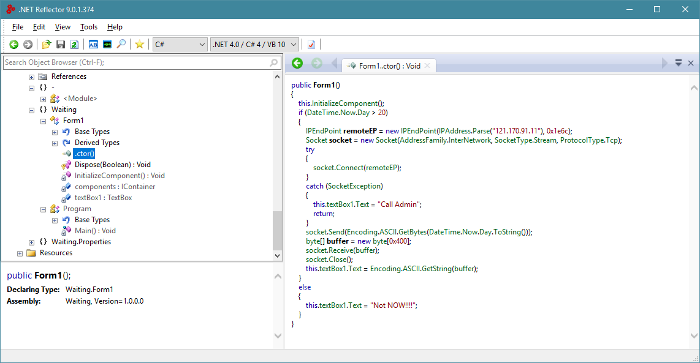

# 2018 DIMI CTF (KDMHS CTF) Final

원래 안쓰려고 했는데 [@JunhoYeo](https://github.com/JunhoYeo)형이 기대된다고 하시길래.. 대충 끄적여 봅니당.

포넙은 못 건들었어요 ㅠ 죄송합니당..

## Reversing
### Waiting

열어보지도 않고 그냥 .NET Reflector로 깠다.



소켓 통신을 하는것 같아서 저 주소를 가지고 nc로 열어봤다.

그냥 1 입력하니까 안된다고 해서 999 입력했더니 플래그가 나왔다!

```
 D3V0NNURI > ~/ctf/2018-DIMI-CTF-BONSUN > nc 121.170.91.11 7788
1
Wait you send wrong day!
 D3V0NNURI > ~/ctf/2018-DIMI-CTF-BONSUN > nc 121.170.91.11 7788
999
The Flag is dimi{the_time_is_running_out}
```


## Web
### DIMI STORAGE

소스 나오기 전까지는 건들지도 않다가 소스 나온다니까 소스 분석하니 다음 코드가 있었다.

```php
if($_GET['password'] != $password) {
  if($_SERVER['HTTP_HOST'] != "127.0.0.1") {
    echo "FAIL - Password Error";
    exit(-1);
  }
}
```

저 HTTP_HOST를 조작할 수 있지 않을까 생각해서 구글링을 했다.

`Host` 헤더를 바꾸면 되는것 같다! cURL은 사용할 줄 몰라서 telnet으로 대충 했다.

```
 D3V0NNURI > ~/ctf/2018-DIMI-CTF-BONSUN > nc 121.170.91.14 80
GET /4e818133cd4413425429613b06a55453/download.php?id=00000000000000000000000000000000 HTTP/1.1
Host: 127.0.0.1 ⏎
⏎

HTTP/1.1 200 OK
Server: Apache/2.4.18 (Ubuntu)
Content-Transfer-Encoding: Binary
Content-disposition: attachment; filename="00000000000000000000000000000000"
Content-Length: 19
Content-Type: application/octet-stream

dimi{iamlocalhost}
```

```
FLAG: dimi{iamlocalhost}
```

## MISC
### guess_returns

게싱이 하나 더 나와따~

생각나는거 유튜브, 픽시브, 임거 다 들어가 보았지만 안되었다!

음.. 비트면 뭐가 있지? 하다가 `goo.gl` 삘받아서 해도 안되서 비슷한거 `bit.ly` 하니까 잘 되었다!

플래그 모르고 있었는데 [@w3bn00b](https://github.com/w3bn00b)님이 PR 해주셨다! 감사의 말씀을 올리고 싶다. 

```
FLAG: dimi{Th1s_1s_3xp3r1enc3_b4sed_gu3ss1ng_1sn't_1t?}
```

### MAAATH

pwntools로 eval해서 풀었다.

완전 대충 풀었다는거 눈에 보이죠.. ㅠㅠ

[math.py](misc/math.py)

```
FLAG: dimi{Yeah, you are good at math!:)}
```

### image

처음에 LSB만 건드리다가.. 힌트도 나오고 누가 먼저 풀어서 이거 풀수 있나 보다 해서 빡집중해따..

준호형이 저번에 [머 올린게](http://nogadaworks.tistory.com/93) 생각나서 각 픽셀을 rgb로 이어서 한 파일로 이었다. Python3용 PIL Wrapper인 Pillow를 이용해서 풀었다.

처음에 width와 height를 바꿔 풀어서.. 애먹어써요 ㅠㅠ

[이어주는 코드](misc/image.py)

이어주게되면 ELF 파일이 주어진다.

실행시키면 플래그가 바로 나온다(?)

```
 D3V0NNURI > /mnt/c/devonnuri/CTF/DIMI CTF BONSUN 2018 > ./imageResult
dimi{ELF_!N_1M4G3}
```

```
FLAG: dimi{ELF_!N_1M4G3}
```
