# 2019 TRUST CTF

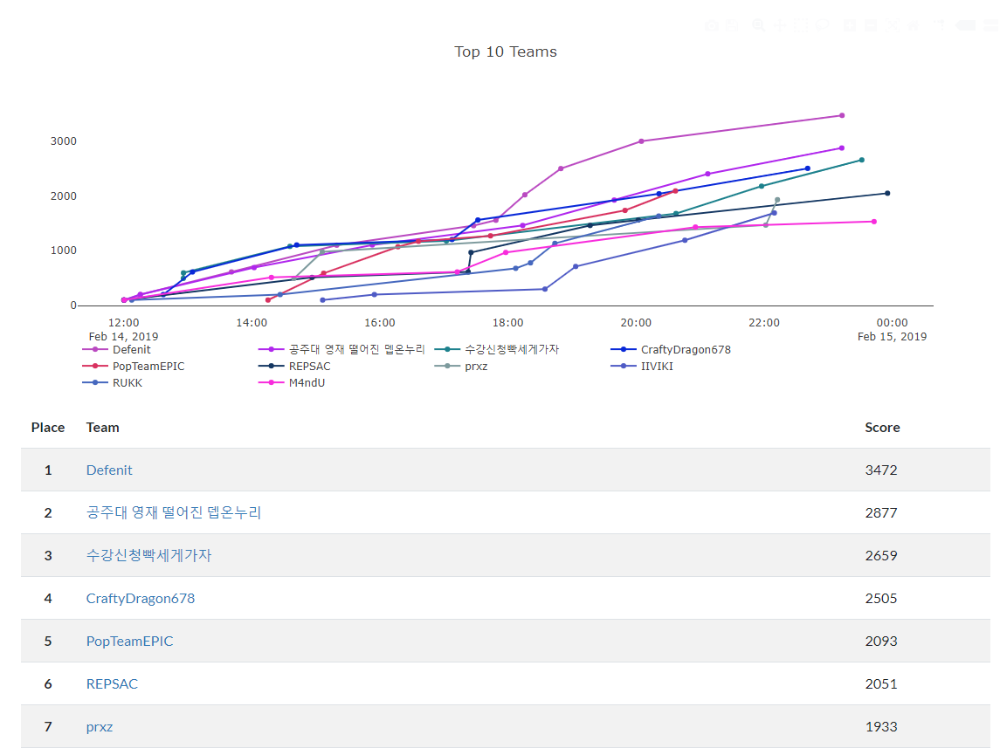
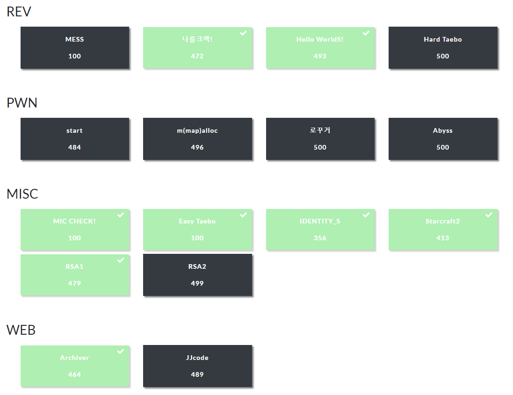

> 공주대 영재 떨어진 뎁온누리 (2등, 2877pts)

실제로 떨어졌습니다 흑흑흑...

저엉말 오랜만에 참가하는 CTF라 감을 거의 다 잃어 좀 속상하긴 했지만, 나름대로 결과는 잘 나온 것 같아서 다행입니다. 헤헤

~~언제나 비어있는 포너블~~

그럼 저퀄 라업 시작하겠습니다

## Web

### Archiver (464pts)

```
엇 새롭게 생긴 Archive 시스템인듯 하당ㅎㅎ

http://archiver.trustctf.com/

*flag는 /flag에 있습니다 *

Author : c2w2m2(이주창)
```

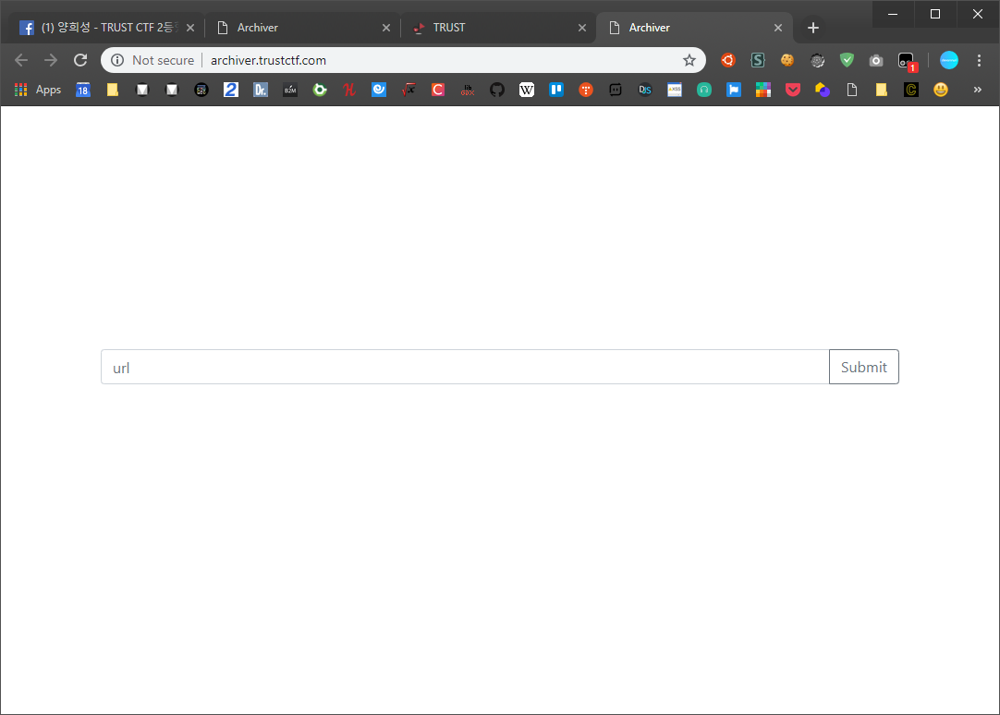

다음과 같은 페이지에 "정말 감사하게도" 소스코드도 같이 줍니다.

중점적으로 볼 코드는 당연히 `main.py`입니다.

```py
#-*- coding: utf-8 -*-
from flask import Flask, request, render_template, redirect, url_for
import requests
import time
import glob
import sys
import util
import os

reload(sys)
sys.setdefaultencoding('utf-8')

app = Flask(__name__)

@app.route('/', methods=['GET'])
def main():
    return render_template('index.html')

@app.route('/listArchive', methods=['POST'])
def listArchive():
    url = request.form['url']
    hashed = util.hashing(url)
    files = glob.glob('%s/%s/*' % (app.config['path'], hashed))
    res = []
    for i in files:
        T = int(i[i.rfind('/')+1:])
        res.append(T)
    res.sort()
    res = res[::-1]
    return render_template('archive.html', url=url, res=res)

@app.route('/saveArchive', methods=['POST'])
def saveArchive():
    url = request.form['url']
    T = int(time.time())
    
    try:
        res = requests.get(url)
    except:  
        return util.alert("Error!")
    
    if res.status_code != 200:
        return util.alert("code is not 200")
    
    data = unicode(res.text)
    hashed = util.hashing(url)

    os.system("mkdir %s/%s" % (app.config['path'], hashed))
    fd = open('%s/%s/%s' % (app.config['path'], hashed, str(T)), 'w')
    fd.write(data)
    fd.close()

    return redirect(url_for('main'))
    
@app.route('/viewArchive', methods=['POST'])
def viewArchive():
    url    = request.form['url']
    T      = request.form['T']
    hashed = util.hashing(url)

    fd = open('%s/%s/%s' % (app.config['path'], hashed, str(T)), 'r')
    data = unicode(fd.read())
    fd.close()
    return render_template('view.html', data=data)
    
@app.template_filter()
def setdatetime(T):
    T = time.gmtime(T)
    return '%04d-%02d-%02d %02d:%02d:%02d' % (T.tm_year, T.tm_mon, T.tm_mday, T.tm_hour, T.tm_min, T.tm_sec)


app.config['path'] = util.getRandPath()
os.system('mkdir %s' % app.config['path'])
app.run(host='0', port=4432, debug=False)
```

정말 문제에 공을 들이신 것 같다.

아무튼 플래그는 /flag에 있다고 하니 파일을 읽을 수 있는 viewArchive 부분을 보자.

url부분은 해싱되기 때문에 어떻게 건들수 없지만 다행히도 맨 끝에 T(타임스탬프)를 필터링 하지 않아서 어떤 파일이든 가져올 수 있다.

그렇다면 뒤로 이동하면서 플래그를 찾으면 될것 같다.


일단 아무 사이트나 입력한 뒤 timestamp가 들어가야할 인자에 파일 이름을 넣어주면 된다.

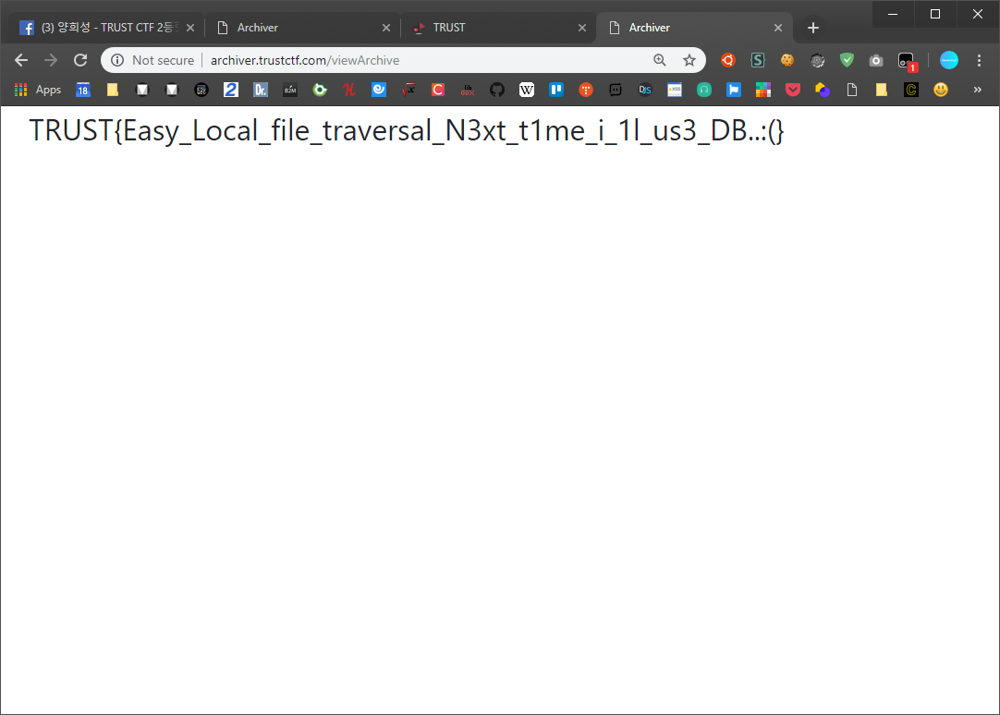

```
FLAG: TRUST{Easy_Local_file_traversal_N3xt_t1me_i_1l_us3_DB..:(}
```

## Reversing

### MESS (100pts)

일단 IDA로 까보자

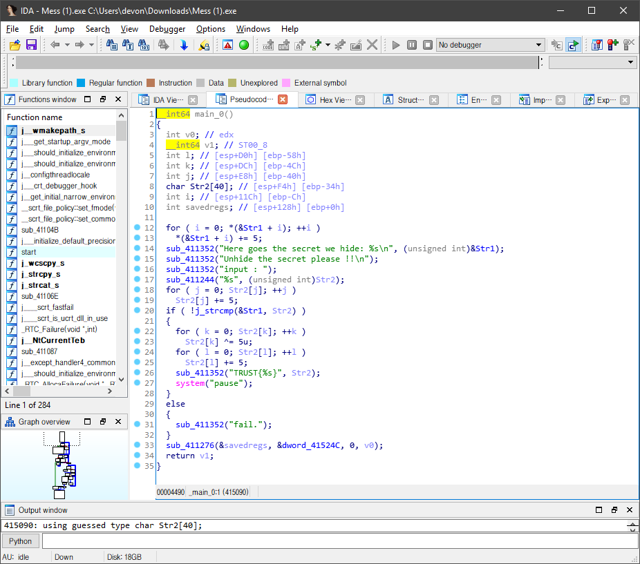

대충 Str1에서 5를 더한 값이랑 입력받은 값에서 5를 더한 값이랑 비교(그니까 그냥 Str1이랑 비교하는거랑 같음)한다.

그래서 맞게 되면 XOR와 더하기 연산해서 출력해준다.

그러면 Str1을 한번 확인해보자.

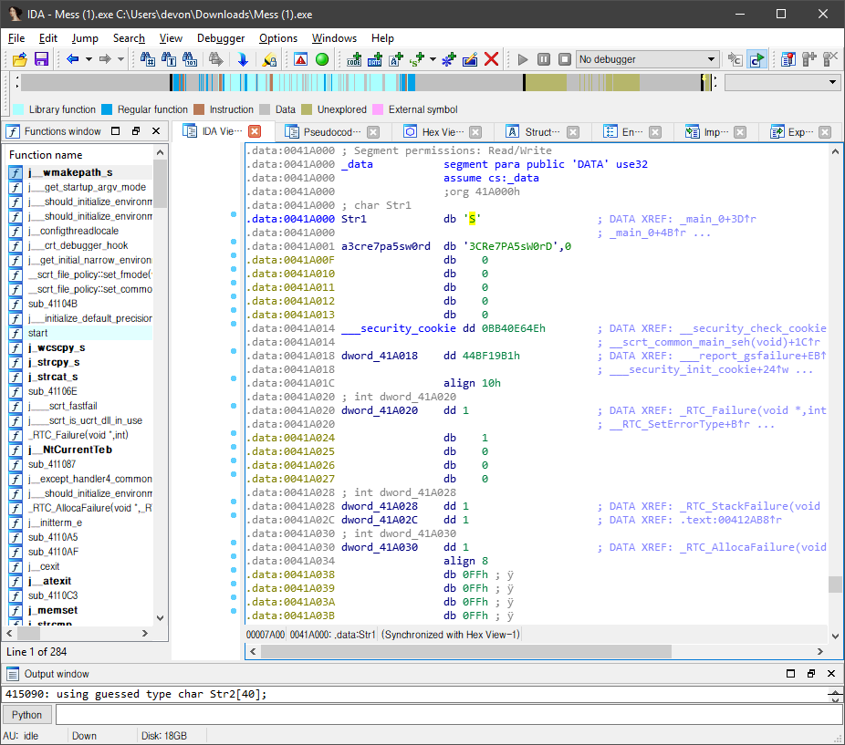

`S3CRe7PA5sW0rD` 문자열을 입력한뒤 한번 확인해보자.

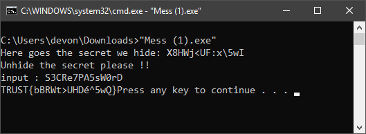

근데 이 문자열 범위가 charset마다 달라서 출력결과가 달라질수 있는데 필자는 cp949라서 다음과 같이 나왔다.

```
FLAG: TRUST{bBRWt>UHDé^5wQ}
```

### 나를크랙! (472pts)

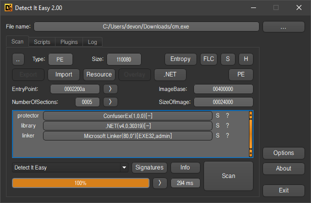

열었더니 ConfuserEx가 걸려있다. dnSpy로 까보자.

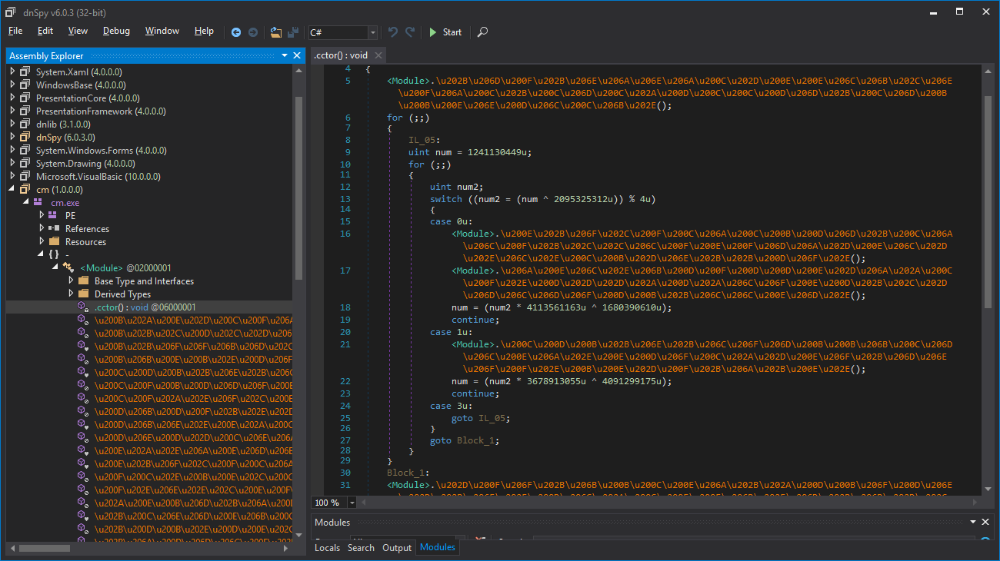

모듈의 cctor이다. 으으 보기도 싫다.

5번줄의 함수를 클릭해서 들어가보면 AntiTamper 함수다.

저럴 경우에는 저 AntiTamper 코드가 진행된 이후의 모듈만 쏙 빼오면 된다.

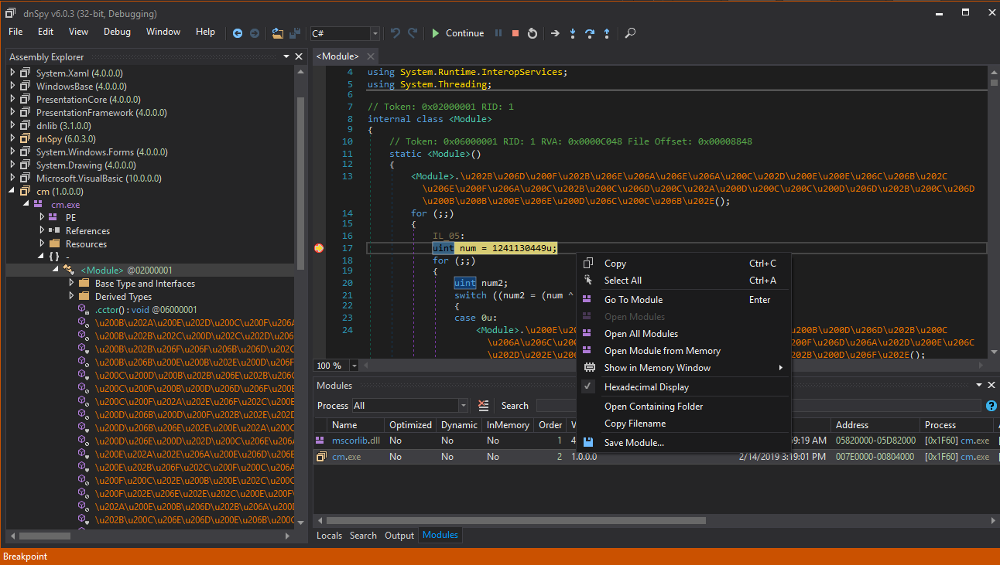

저기 `Open Module from Memory`를 실행시키면 AntiTamper가 해제된 모듈을 불러올 수 있다.

해제된 모듈을 이리저리 살피다 보면 폼을 발견할 수 있다. 그리고 Clipboard 관련 코드를 발견한다.

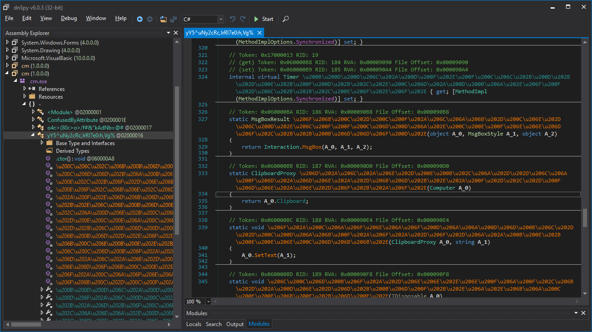

그러자.. ConfuserEx가 패킹되어있음에도 솔버수가 많다는 걸 눈치채고 나서 바로 직접 실행해 메모장에 붙여넣었다.

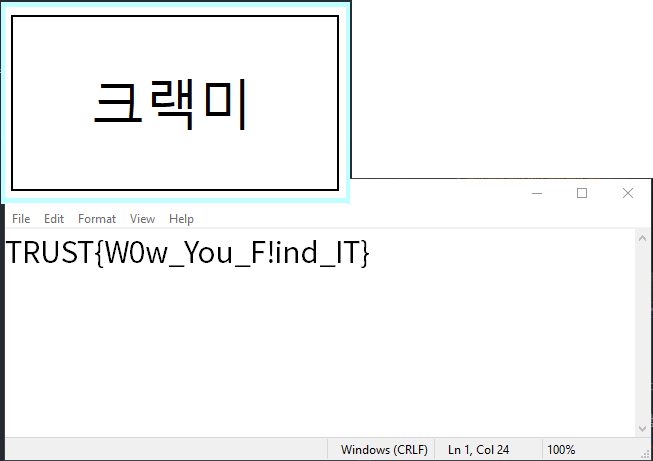

```
FLAG: TRUST{W0w_You_F!ind_IT}
```

### Hello WorldS! (493pts)

```
So many "Hello World" programs....

dukup11ch1 made 8 programs

you just find his programs and write "Yara rule" 


"Hello World"프로그램이 많아...

dukup11ch1가 8개를 만들었어.

그의 프로그램들을 찾고 "Yara rule"을 작성하세요

nc server.trustctf.com 5252

(Code the rule in one line.) (rule은 한줄로 짜시오.)

Author : dukup11ch1(유기환)
```

Yara라는걸 처음 접해서 어떻게 하는지 몰라 [여기](https://yara.readthedocs.io/en/v3.4.0/writingrules.html)를 참고했다.

```py
import yara

rule = input("Input your rule... ")

try:
    crule = yara.compile(source=rule)
except yara.SyntaxError:
    print("SystaxError!")
    exit()
except:
    exit()
count = 0
filelist=["1.exe", "2.exe", "3.exe", "4.exe", "5.exe", "6.exe", "7.exe", "8.exe", "9.exe", "10.exe", "11.exe", "12.exe", "13.exe", "14.exe", "15.exe", "16.exe"]
myfile=["6.exe", "7.exe", "8.exe", "9.exe", "10.exe", "11.exe", "13.exe", "14.exe"]
notmine=["1.exe", "2.exe", "3.exe", "4.exe", "5.exe", "12.exe", "15.exe", "16.exe"]
for file in filelist:
    fp = open('/home/ctf/' + file,'rb')
    fdata=fp.read()
    matches = crule.match(data=fdata)
    if (file in myfile and matches != []):
        count = count+1
        #print(file)
    elif file in notmine and matches == []:
        count = count+1
        #print(file)
    fp.close()
if count == 16:
    print("TRUST{EXAMPLE_FLAG}")
```

코드를 보면 `myfile` 리스트의 파일들은 매칭되어야 하고 `notmine`의 파일들은 매칭되면 안되는 코드로 보인다.

그럼 공통점을 찾아보자.

`8.exe`와 `13.exe`는 둘다 10240바이트이고, `6.exe 7.exe 9.exe 10.exe 11.exe 14.exe`는 `3C 2C 3C 7F 78 4D 52 2C 78 4D 52 2C 78 4D 52 2C 71 ...` 바이트를 가진다는 공통점을 지닌다.

그러면 그를 바탕으로 yara rule을 작성해보자.

```
rule dummy
{
    strings:
        $a = { 3C 2C 3C 7F 78 4D 52 2C 78 4D 52 2C 78 4D 52 2C 71 35 C1 2C 72 4D 52 2C AA 29 53 2D 7B 4D 52 2C AA 29 51 2D 79 4D 52 2C AA 29 57 2D 6A 4D 52 2C AA 29 56 2D 75 4D 52 2C 1D 2B 53 2D 7A 4D 52 2C 78 4D 53 2C 55 4D 52 2C 93 29 5B 2D 7A 4D 52 2C 93 29 AD 2C 79 4D 52 2C 93 29 50 2D 79 4D 52 2C 52 69 63 68 78 4D 52}
    condition:
       filesize == 10240 or $a
}

rule dummy { strings: $a = { 3C 2C 3C 7F 78 4D 52 2C 78 4D 52 2C 78 4D 52 2C 71 35 C1 2C 72 4D 52 2C AA 29 53 2D 7B 4D 52 2C AA 29 51 2D 79 4D 52 2C AA 29 57 2D 6A 4D 52 2C AA 29 56 2D 75 4D 52 2C 1D 2B 53 2D 7A 4D 52 2C 78 4D 53 2C 55 4D 52 2C 93 29 5B 2D 7A 4D 52 2C 93 29 AD 2C 79 4D 52 2C 93 29 50 2D 79 4D 52 2C 52 69 63 68 78 4D 52} condition: filesize == 10240 or $a }
```

다음과 같이 작성해서 nc로 보내면 플래그가 나온다.

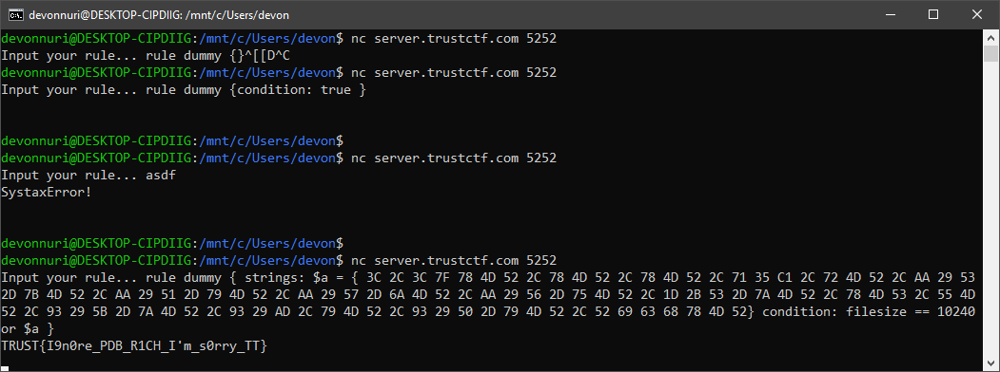

```
FLAG: TRUST{I9n0re_PDB_R1CH_I'm_s0rry_TT}
```

## Misc

### MIC CHECK! (100pts)

```
1st TRUST CTF에 오신걸 환영합니다!

Notifications과 Rules를 반드시 읽어주세요!

디스코드(IRC) : https://discord.gg/ZYyupm8

Flag : TRUST{Welcome_CTF_Have_FUN!}
```

```
FLAG: TRUST{Welcome_CTF_Have_FUN!}
```

### Easy Taebo (100pts)

```
TRUST CTF에서도 태.보.해.

nc server.trustctf.com 44923

Author : st4nw(조정훈)
```

여러분들 모두 태보해 @==(^o^)@

아무튼 다음 액션 리스트도 같이 준다.

```
'left_jab' : '@==(^0^)@'
'left_mid_jab' : '@=(^0^)@'
'mid_jab' : '@(^0^)@'
'right_mid_jab' : '@(^0^)=@'
'right_jab' : '@(^0^)==@'
'left_hook' : '@(^0^)@=='
'right_hook' : '==@(^0^)@'
'left_speedball' : '@@@(^0^)'
'right_speedball' : '(^0^)@@@'
'left_kick' : '@||(^0^)==@'
'mid_kick' : '@==(^||^)==@'
'right_kick' : '@==(^0^)||@'
```

이걸 가지고 코드를 슥삭 짜면 된다.

```py
from pwn import *
from time import sleep

context.log_level = 'DEBUG'

r = remote('server.trustctf.com', 44923)
r.recvuntil('Ready : Taebo starts in 3 seconds\n\n')
sleep(4)

for i in range(100):
    r.recvuntil('Taebo ')
    line = r.recvuntil(' >> ')
    line = line.split(' : ')[1][:-4]
    log.info(line)
    tblist = line.split(' + ')
    tbskill = {
    'left_jab': '@==(^0^)@',
    'left_mid_jab': '@=(^0^)@',
    'mid_jab': '@(^0^)@',
    'right_mid_jab': '@(^0^)=@',
    'right_jab' : '@(^0^)==@',
    'left_hook' : '@(^0^)@==',
    'right_hook' : '==@(^0^)@',
    'left_speedball' : '@@@(^0^)',
    'right_speedball' : '(^0^)@@@',
    'left_kick' : '@||(^0^)==@',
    'mid_kick' : '@==(^||^)==@',
    'right_kick' : '@==(^0^)||@'
    }

    result = ""
    for tb in tblist:
        result += tbskill[tb] + " "
    r.recv()
    r.sendline(result.strip())
r.recvuntil('}')
```

정말 급하게 짠 코드라 그냥 작동은 한다.

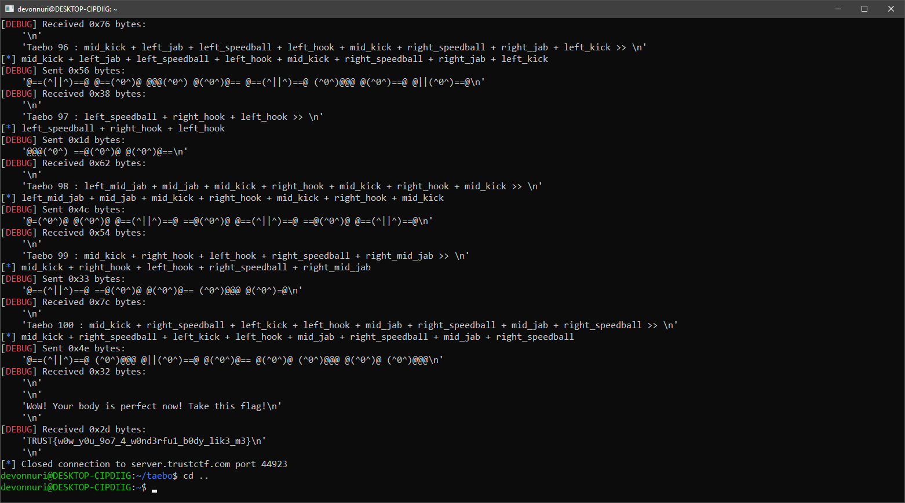

### IDENTITY_5 (356pts)

```
확장자는 identity_5.apk 입니다. .zip을 지워주세요.
I recommend excute it!!! and input "trust", "TRUST", "flag"!!!! have a good luck :)

flag3 : https://bit.ly/2S7lqhH

Author : m0nday(이동준)
```

jadx로 디컴한 코드를 보자.

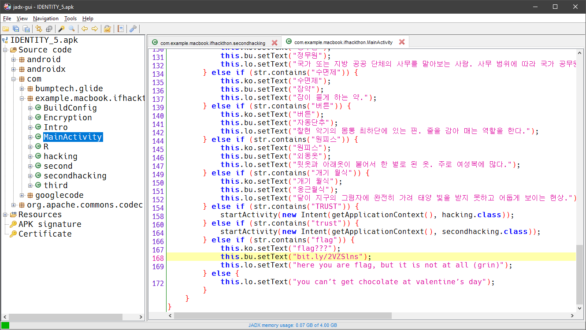

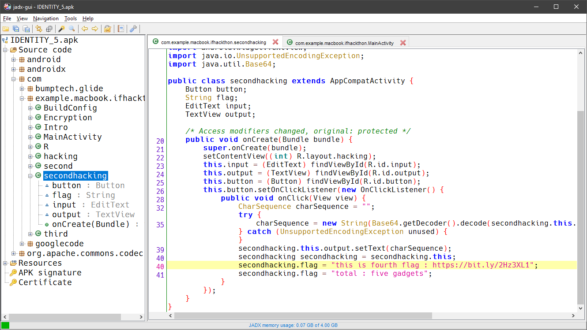

그리고 apktool로 리소스를 확인해보자.

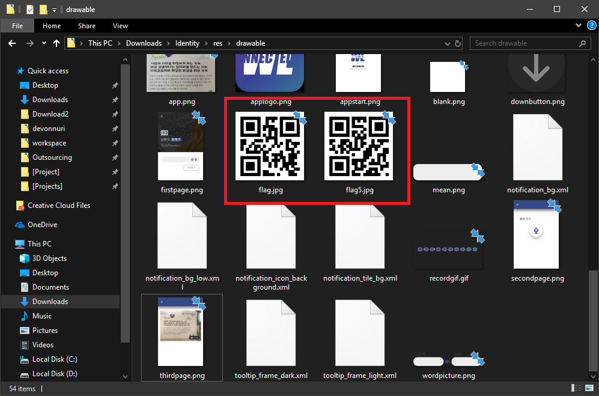

이제 모든 QR코드들(위에 설명에 있는것 추가)을 모아보자.


이 QR코드를 전부 찍어서 연결하면 플래그가 나온다.

```
FLAG: TRUST{Th1s_1s_fl@g_@ndr0id_@add_Qrc0d3}
```

### Starcraft2 (413pts)

```
SC2 is What?

Author : dukup11ch1(유기환)
```

스타크래프트를 까느라 시간이 거의 지나간것 같았다. 처음에는 에디터가 안열려서 걱정하고 있었는데 알고보니까 계속 기다려야 했던거였다.

아무튼 기다리고 조금 있으면 미니맵으로 플래그가 나온다.

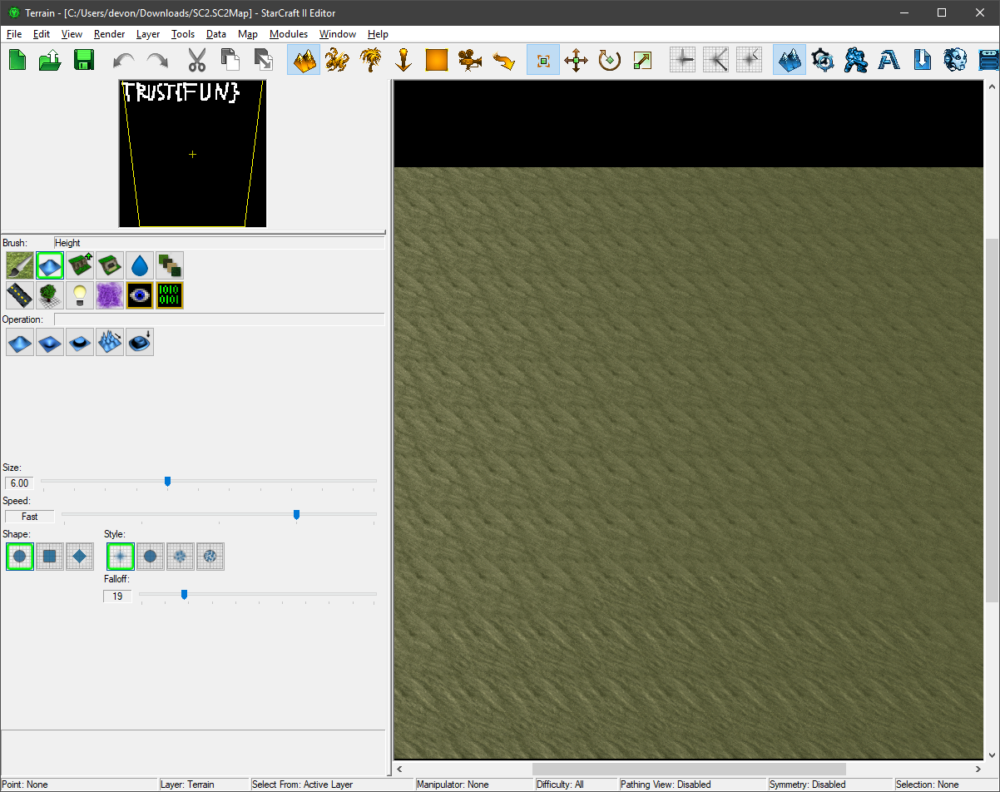

```
FLAG: TRUST{FUN}
```

### RSA1 (479pts)

```
RSA 암호문 : 1649729212658550722856763813613372
암호화에 사용된 소수 1 : 36465956589847261
암호화에 사용된 소수 2 : 46496464168468673
복호화 키 : 1275312736838027047985273062147003 
플래그 형식:TRUST{~복호화값~}

Author : 생선스프 (문의 : m0nday)
```

RSA 복호화는 [dcode.fr](https://www.dcode.fr/rsa-cipher)에서 방법을 찾게 되었다.

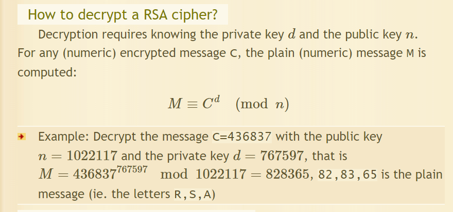

파이썬으로 돌린 뒤에 두 숫자씩 끊어서 아스키로 바꾸면 플래그가 나온다.

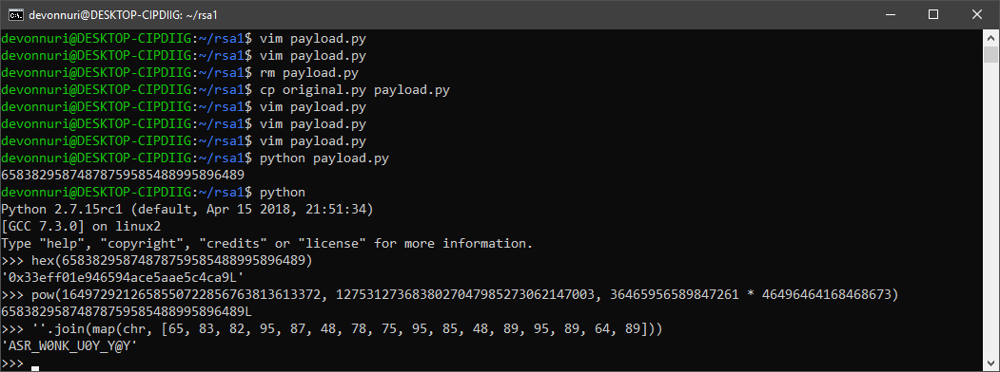

```
FLAG: TRUST{ASR_W0NK_U0Y_Y@Y}
```
